# Common SRE Misconceptions

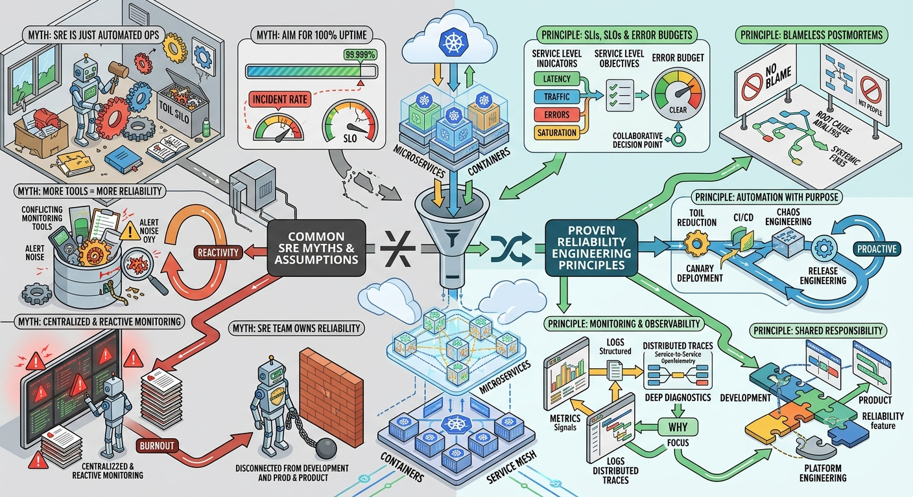

# Introduction

Ask ten people:

> "What does an SRE do?"

You will probably get ten different answers.

Some will say:

```text
SREs are production support engineers.
```

Others will say:

```text
SREs are DevOps engineers with a different title.
```

Some believe:

```text
SRE teams own every incident.
```

Others think:

```text
SREs only build dashboards.
```

The reality is more nuanced.

As Site Reliability Engineering has become more popular, many organizations have adopted the title without fully adopting the principles behind it.

As a result, misconceptions have emerged.

Understanding these misconceptions is important because they can affect:

- Team structure
- Priorities
- Expectations
- Engineering culture
- Reliability outcomes

This chapter explores some of the most common misunderstandings surrounding Site Reliability Engineering.

---

# Why Misconceptions Matter

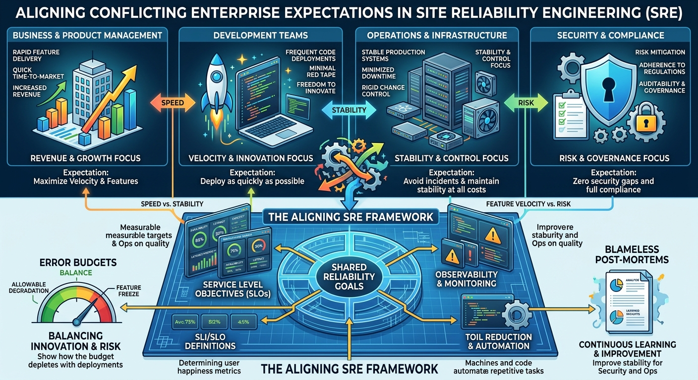

Imagine an organization creates an SRE team.

Leadership believes:

```text
SRE will solve all operational problems.
```

Developers believe:

```text
SRE will own production.
```

Operations teams believe:

```text
SRE will replace us.
```

The SRE team believes:

```text
We are here to improve reliability through engineering.
```

Everyone starts with different expectations.

The result is confusion.

Many failed SRE transformations have little to do with technology and everything to do with misunderstanding the purpose of SRE.

---

# Misconception #1

# SRE Is Just Production Support

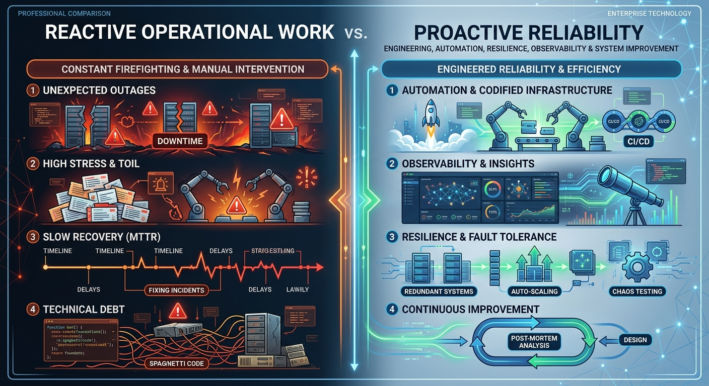

This is perhaps the most common misconception.

Many people hear:

```text
Site Reliability Engineering
```

and immediately think:

```text
Incident Response

Monitoring

Support Tickets
```

While SREs absolutely participate in production support activities, that is only part of the role.

If an engineer spends 100% of their time:

- Responding to alerts
- Restarting services
- Investigating tickets
- Handling incidents

they are acting primarily as an operations engineer.

SRE goes beyond operational response.

SRE focuses on:

- Automation
- Reliability Engineering
- Observability
- Capacity Planning
- Resilience
- Toil Reduction
- System Design Improvements

An SRE should not only solve today's incident.

An SRE should help prevent tomorrow's incident.

---

# Misconception #2

# DevOps and SRE Are the Same Thing

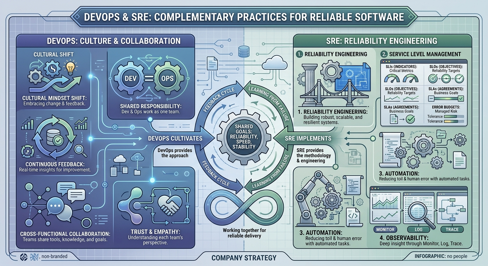

This misconception often appears because the two disciplines share many goals.

Both care about:

- Automation
- Collaboration
- Faster delivery
- Better reliability

However:

```text
DevOps
```

is primarily a philosophy and cultural movement.

While:

```text
SRE
```

is a practical engineering discipline for achieving reliability objectives.

A useful way to think about it:

```text
DevOps

↓

Culture
```

```text
SRE

↓

Implementation
```

You can practice DevOps without a formal SRE team.

You can run SRE teams while embracing DevOps principles.

They complement each other.

They do not compete.

---

# Misconception #3

# Reliability Means Zero Failures

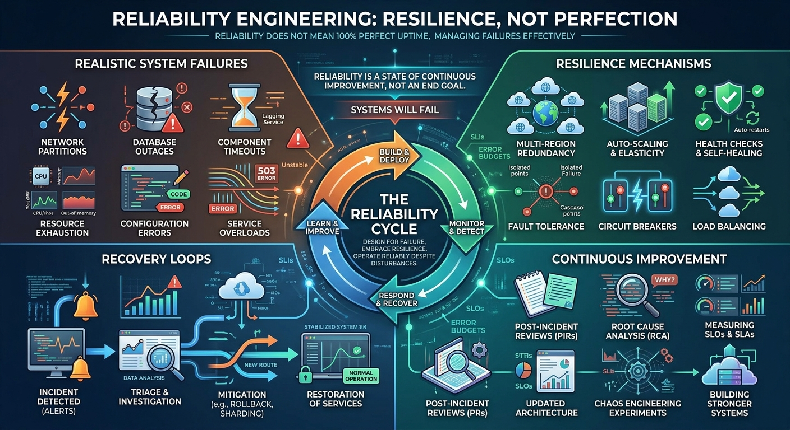

The word:

```text
Reliability
```

often creates unrealistic expectations.

Some stakeholders assume:

```text
Reliable

=

Never Fails
```

This is not how SRE works.

A core reliability principle is:

> Failure is inevitable.

Servers fail.

Software contains bugs.

Networks experience issues.

Cloud providers experience outages.

Humans make mistakes.

The goal of SRE is not to eliminate all failures.

The goal is to:

- Minimize impact
- Detect issues early
- Recover quickly
- Learn continuously

Perfect reliability is neither realistic nor economical.

---

# Misconception #4

# More Monitoring Means Better Reliability

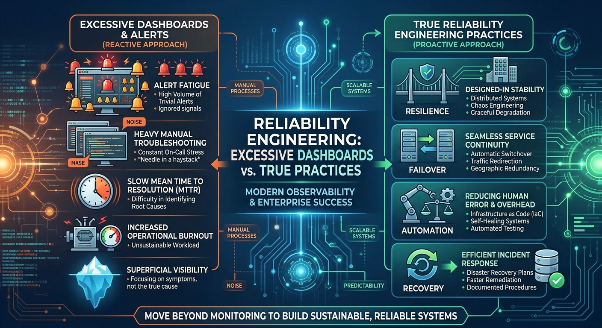

Many teams react to incidents by adding more dashboards.

Soon they have:

```text
Thousands of Metrics

Hundreds of Dashboards

Dozens of Alerts
```

Yet incidents continue.

Why?

Because visibility alone does not create reliability.

Monitoring helps identify problems.

Reliability requires:

- Engineering discipline
- Resilient architecture
- Good operational practices
- Effective recovery processes

A dashboard cannot compensate for poor system design.

---

# Misconception #5

# SRE Owns Reliability Alone

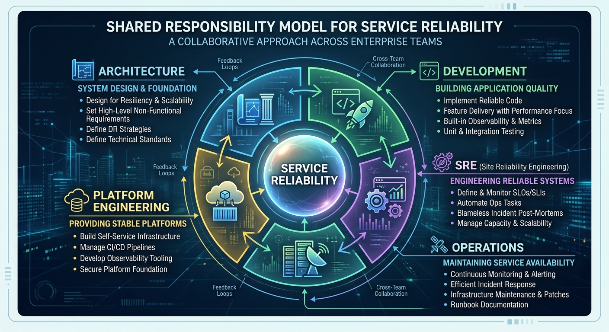

One of the most damaging misconceptions is:

```text
Reliability belongs to the SRE team.
```

Imagine a development team says:

```text
We build features.

SRE handles reliability.
```

This is a dangerous mindset.

Reliability is a shared responsibility.

Developers influence:

- Code quality
- Testing quality
- System behavior

Architects influence:

- Design decisions
- Dependency choices

Platform teams influence:

- Infrastructure
- Deployment processes

SRE should enable and guide reliability.

They should not become the only owners of it.

---

# Misconception #6

# SRE Exists Only in Large Technology Companies

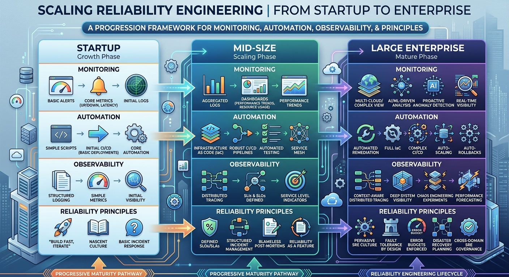

Many engineers assume:

```text
SRE is only for companies the size of Google.
```

The principles are useful regardless of scale.

A startup may not need:

```text
Dedicated SRE Team
```

yet.

However, it can still benefit from:

- Monitoring
- Error Budgets
- Reliability Targets
- Automation
- Incident Reviews

SRE is not defined by team size.

It is defined by mindset and practices.

---

# Misconception #7

# Automation Solves Everything

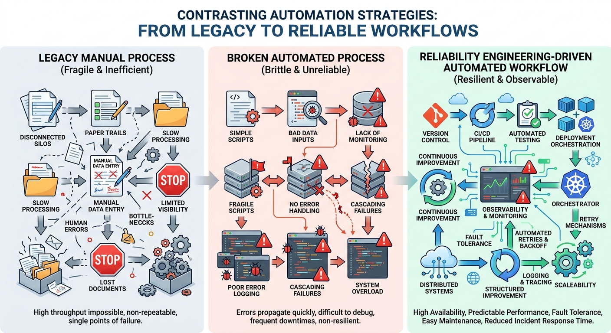

Automation is powerful.

SRE strongly encourages automation.

However:

```text
Automation ≠ Magic
```

Automating a broken process often creates faster failure.

For example:

### Bad Process

```text
Unclear deployment procedure
```

Automated version:

```text
Unclear deployment procedure

...but faster
```

Successful automation requires:

- Defined processes
- Clear ownership
- Good design
- Continuous improvement

Automation is a tool, not a strategy.

---

# Misconception #8

# Every Alert Needs Human Action

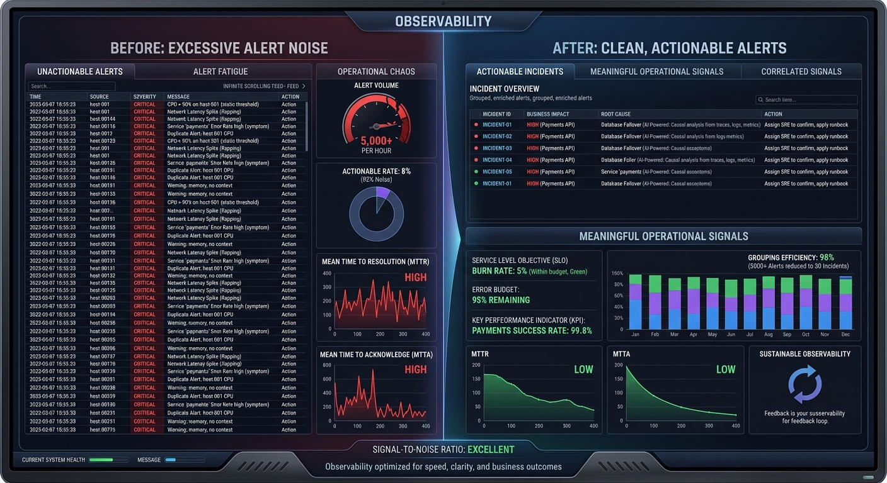

A common operational anti-pattern is:

```text
Generate alerts for everything.
```

This usually results in:

- Noise
- Alert fatigue
- Ignored notifications

A healthy alert should answer:

> Does someone need to take action right now?

If the answer is:

```text
No
```

it probably should not be an alert.

Good SRE practices focus on:

- Actionable alerts
- Meaningful alerts
- User-impacting alerts

Quality matters more than quantity.

---

# Misconception #9

# Incident Response Is the Most Important Part of SRE

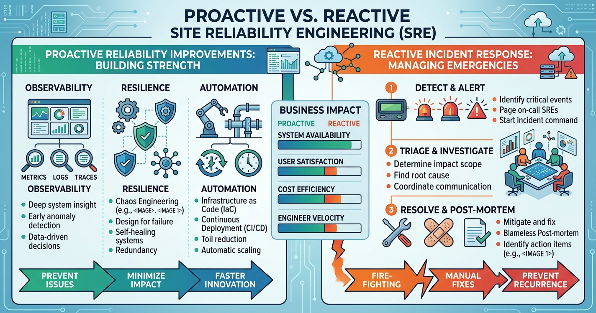

Incidents are highly visible.

Because incidents receive attention, people sometimes believe they are the primary purpose of SRE.

In reality:

The best SRE work often happens before incidents occur.

Examples include:

- Better architecture
- Better observability
- Better automation
- Better testing
- Better resilience

A mature SRE organization aims to spend more time:

```text
Preventing Problems
```

than

```text
Responding To Problems
```

---

# Misconception #10

# SRE Is a Toolset

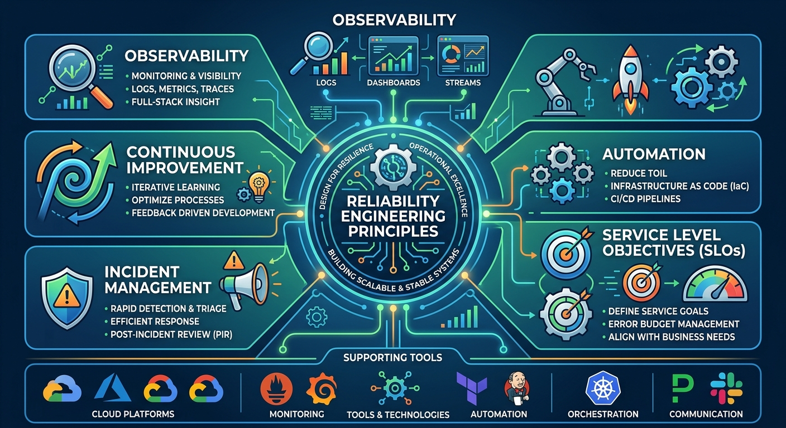

Some engineers think:

```text
Prometheus

+

Grafana

+

Kubernetes

=

SRE
```

These tools are useful.

But SRE is not a collection of technologies.

SRE is an approach to operating systems reliably.

Tools may change.

Principles remain.

An engineer can practice many SRE concepts without any specific technology stack.

The mindset matters more than the tooling.

---

# Misconception #11

# SRE Is Only About Infrastructure

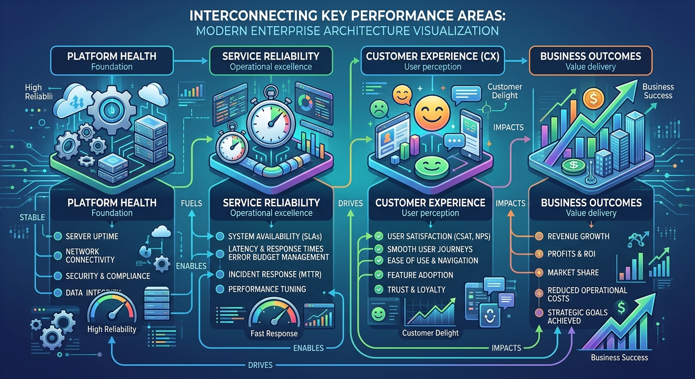

Infrastructure is important.

However, customers do not consume infrastructure.

Customers consume services.

An SRE should think about:

```text
Customer Experience

Business Outcomes

Service Behavior

User Impact
```

not just:

```text
CPU

Memory

Storage
```

Reliability is ultimately about delivering value to users consistently.

---

# Misconception #12

# SRE Success Can Be Measured Only by Uptime

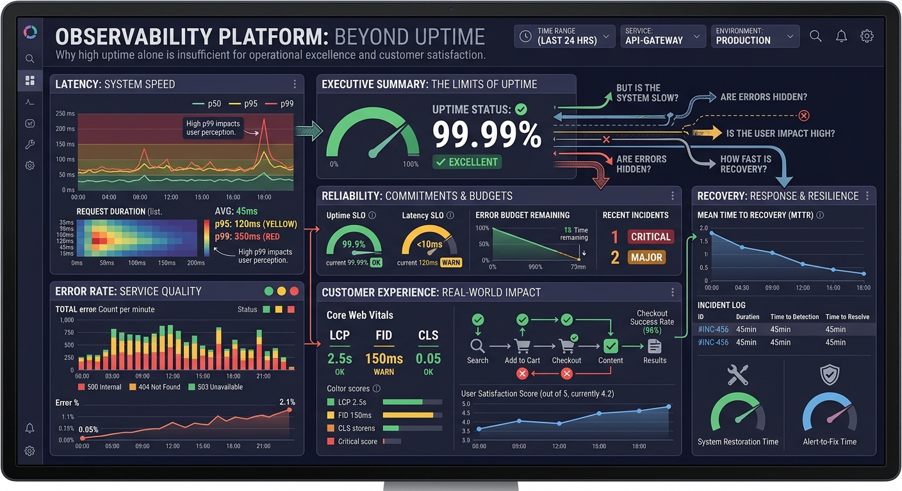

Uptime is important.

But uptime alone rarely tells the entire story.

Consider:

```text
System Availability

100%
```

Yet:

```text
Requests Take 30 Seconds

Transactions Fail

Users Abandon Operations
```

Technically:

```text
Available
```

Practically:

```text
Poor User Experience
```

SRE success should include:

- Reliability
- Latency
- Error Rates
- Customer Experience
- Recovery Time
- Operational Maturity

---

# The Reality of SRE

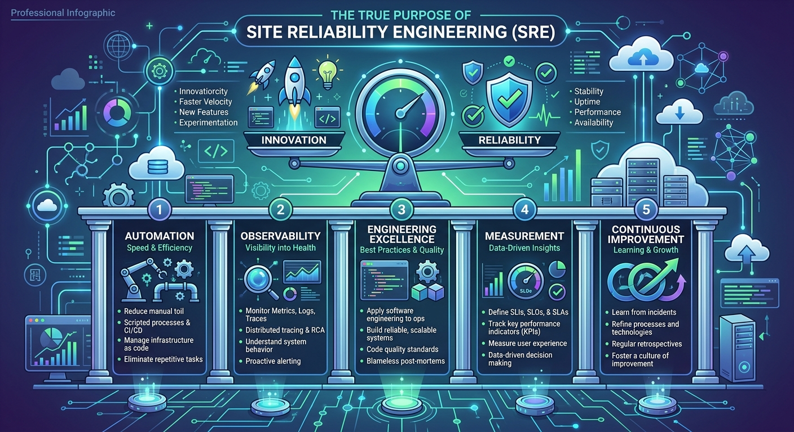

At its core, Site Reliability Engineering is about balancing:

```text
Innovation

AND

Reliability
```

while using:

```text
Engineering

Automation

Observability

Measurement

Continuous Improvement
```

to achieve that balance.

Great SRE teams are not measured by how busy they are.

They are measured by:

- Reliability improvements
- Reduced toil
- Faster recovery
- Better customer experience
- Sustainable operations

---

# What Experienced SREs Eventually Learn

The longer someone works in reliability engineering, the more they realize:

```text
Technology is only part of the challenge.
```

The biggest improvements often come from:

- Better processes
- Better collaboration
- Better ownership
- Better feedback loops
- Better engineering decisions

Successful SRE is as much about systems thinking as it is about systems engineering.

---

# Closing Thoughts

Throughout this Fundamentals section, we've explored:

- What SRE is
- Why SRE exists
- How SRE differs from DevOps
- Reliability principles
- SLI, SLO and SLA
- Error Budgets
- Toil Reduction
- Golden Signals
- Important SRE Metrics
- Production Readiness

The next sections of this repository move from philosophy into practice.

We will start exploring the technologies, techniques, troubleshooting approaches, and operational patterns that make modern reliability engineering possible.

---

# Key Takeaways

✅ SRE is much more than production support.

✅ DevOps and SRE are complementary.

✅ Reliability does not mean zero failures.

✅ Reliability is a shared responsibility.

✅ Monitoring alone does not create reliability.

✅ More alerts do not automatically improve operations.

✅ Automation should support good processes.

✅ Prevention is often more valuable than reaction.

✅ SRE is a discipline, not a toolset.

✅ Reliability ultimately exists to improve user experience.

---

> "The goal of SRE is not to eliminate every failure. The goal is to build systems and organizations that respond to failure intelligently."