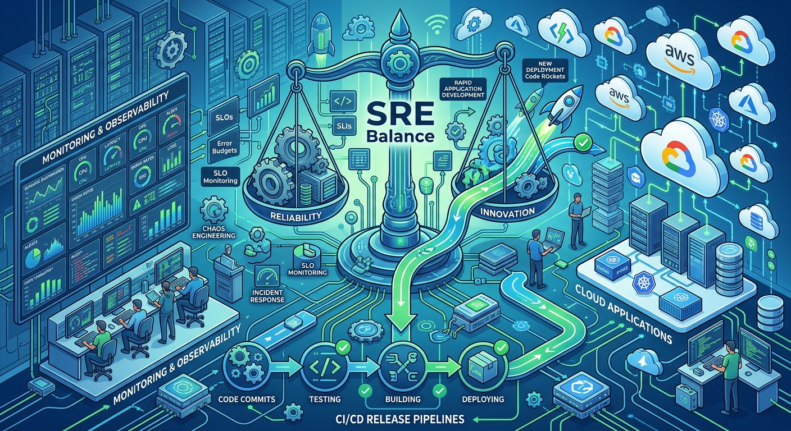
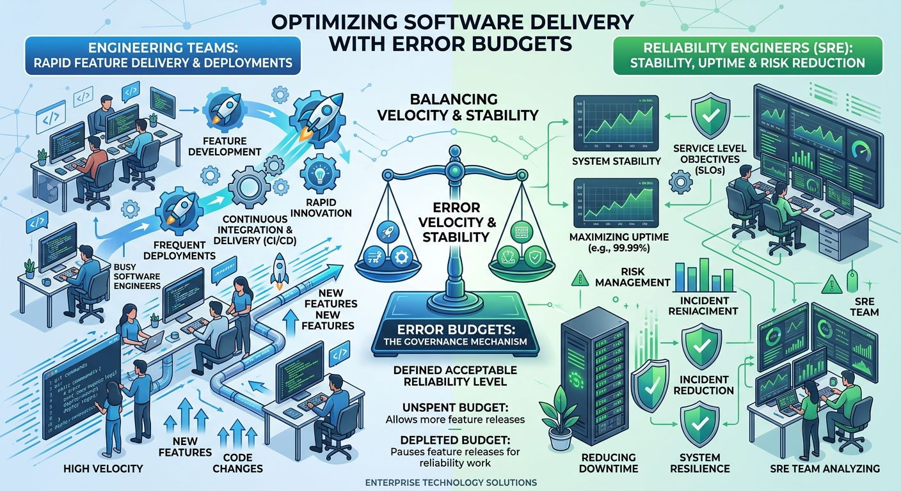
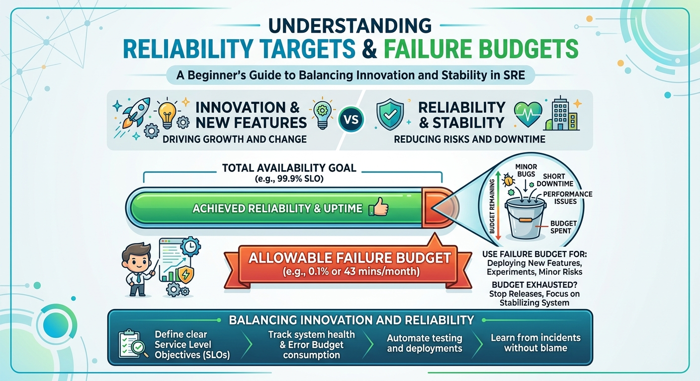
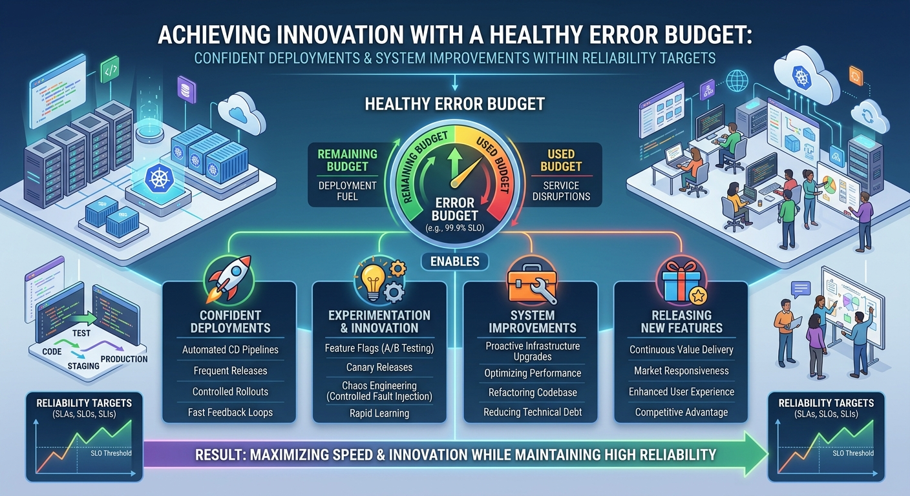
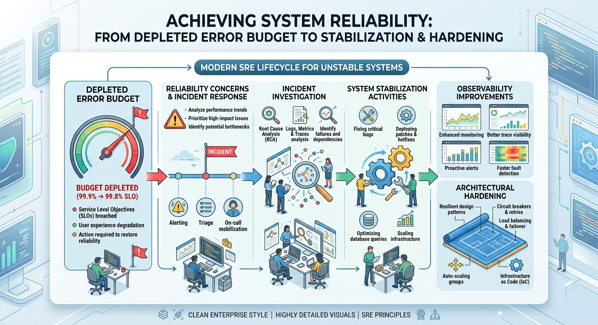

# Error Budgets



# Introduction

Imagine two engineering teams.

The first team says:

> "We must never have an outage."

The second team says:

> "We need to release new features faster."

Both teams have good intentions.

The problem is that these goals often compete with each other.

Every change introduces risk.

Every deployment has the potential to cause failure.

At the same time, refusing to make changes means innovation slows down.

So how do successful technology companies balance:

```text
Innovation
      AND
Reliability
```

The answer lies in one of the most powerful concepts in Site Reliability Engineering:

# Error Budgets

Error Budgets help organizations answer an important question:

> How much unreliability is acceptable?

---

# The Problem With Chasing Perfection

Many organizations initially believe:

```text
100% Availability
```

should be the goal.

At first glance, this sounds reasonable.

Who wouldn't want a system that never fails?

The reality is very different.

Achieving extremely high levels of reliability becomes progressively more expensive.

For example:

```text
99%
```

is relatively easy.

```text
99.9%
```

requires significantly more effort.

```text
99.99%
```

requires even more engineering investment.

```text
99.999%
```

can require entirely different architectures, operational models, and costs.

The closer we move toward perfection, the more expensive each additional improvement becomes.

This leads to an important realization:

> Reliability is not free.

Organizations must decide how much reliability is actually required.

---

# The Birth of Error Budgets



Before Error Budgets, conversations often looked like this:

### Development Team

```text
Let's release faster.
```

### Operations Team

```text
Let's avoid all risk.
```

Both sides had valid concerns.

Unfortunately, neither side had objective data.

Discussions often became opinions.

Error Budgets changed the conversation.

Instead of asking:

```text
Should we prioritize reliability?

Or should we prioritize innovation?
```

SRE asks:

```text
What does our reliability budget allow?
```

Now decisions can be driven by data.

---

# What Is an Error Budget?

An Error Budget represents the amount of failure a service is allowed to experience while still meeting its SLO.

Simply put:

```text
Error Budget

=

100%

-

SLO
```

---

## Example

Suppose a service has an SLO of:

```text
99.9%
```

This means:

```text
0.1%
```

of requests can fail.

That:

```text
0.1%
```

is the Error Budget.

---

### Visual Representation

```text
Successful Requests

99.9%
██████████████████████████

Allowed Failures

0.1%
█
```

The service is still considered healthy because it remains within its agreed reliability target.

---

# Why Error Budgets Are Powerful



Error Budgets create a healthy balance between:

```text
Innovation
      AND
Reliability
```

Without Error Budgets:

```text
Reliability teams say "No"

Development teams push for change
```

With Error Budgets:

```text
Data decides.
```

If sufficient Error Budget remains:

```text
Deploy more frequently.

Experiment carefully.

Release new features.
```

If the budget is exhausted:

```text
Focus on improving reliability.

Reduce operational risk.

Fix underlying issues.
```

This removes emotion from the discussion.

---

# Understanding Error Budgets Through an Example

Imagine a service processes:

```text
1,000,000 requests
```

per month.

The agreed SLO is:

```text
99.95%
```

---

Allowed failure:

```text
0.05%
```

---

Error Budget:

```text
1,000,000 × 0.0005

=

500 requests
```

The service can experience:

```text
500 failed requests
```

and still meet the SLO.

---

If actual failures are:

```text
250
```

The service still has:

```text
250 requests
```

remaining in its Error Budget.

---

If actual failures reach:

```text
600
```

The Error Budget has been exceeded.

The SLO is now violated.

---

# A More Relatable Example

Imagine a school.

Students are expected to attend classes regularly.

Perfect attendance:

```text
100%
```

would be ideal.

However, schools recognize that occasional absences happen.

A small number of absences may be acceptable.

Too many absences become a problem.

An Error Budget works in a similar way.

Small failures are expected.

Too many failures indicate that corrective action is required.

---

# What Happens When Error Budget Is Healthy?



When sufficient Error Budget remains:

Teams often feel comfortable:

- Deploying new features
- Testing improvements
- Refactoring code
- Upgrading dependencies
- Experimenting with architecture changes

This encourages innovation.

Engineers can move faster while staying within agreed reliability boundaries.

---

# What Happens When Error Budget Is Exhausted?



Suppose reliability drops below the agreed SLO.

The service has now consumed all available Error Budget.

At this point, organizations may temporarily shift focus toward reliability improvements.

For example:

### Pause Risky Changes

```text
Reduce deployment frequency.
```

---

### Improve Stability

```text
Investigate incidents.

Fix recurring problems.

Reduce technical debt.
```

---

### Improve Observability

```text
Add metrics.

Improve alerting.

Enhance dashboards.
```

---

### Strengthen Resilience

```text
Increase redundancy.

Improve failover.

Optimize recovery procedures.
```

The goal is not punishment.

The goal is restoring reliability.

---

# Error Budgets Promote Shared Ownership

One of the biggest benefits of Error Budgets is that they create alignment.

Without Error Budgets:

```text
Developers want speed.

Operations want stability.
```

With Error Budgets:

```text
Everyone shares the same reliability goal.
```

Now teams can ask:

> Are we operating within our reliability target?

Instead of arguing:

> Should we release or not?

This creates healthier engineering conversations.

---

# Common Mistakes

## Treating Error Budget as an Excuse for Failure

An Error Budget does not mean:

```text
Failure is acceptable.
```

It means:

```text
Some failure is expected.
```

The goal remains continuous improvement.

---

## Ignoring Error Budget Consumption

Some teams calculate Error Budgets but never monitor them.

This defeats the purpose.

Error Budgets should be tracked continuously.

---

## Unrealistic SLOs

If the SLO is unrealistic:

```text
Error Budget becomes meaningless.
```

Reliability targets must align with business needs.

---

## Focusing Only on Availability

Error Budgets can be applied to:

- Availability
- Latency
- Error Rates
- Processing Success
- Customer Experience

Not just uptime.

---

# Error Budgets in Everyday Life

Error Budgets exist outside technology too.

### Road Travel

You plan for:

```text
Traffic delays.
```

Not every journey is perfectly smooth.

---

### Manufacturing

Factories allow for acceptable quality tolerances.

Perfect production is rarely achievable.

---

### Project Planning

Schedules often include contingency buffers.

Unexpected delays are expected.

---

The same idea applies in Reliability Engineering.

Some failure is inevitable.

The important question is:

> How much failure can the system tolerate before action becomes necessary?

---

# Why Error Budgets Changed the Industry

Before Error Budgets:

```text
Reliability discussions were subjective.
```

After Error Budgets:

```text
Reliability became measurable.
```

Organizations could now:

- Balance risk more effectively
- Make better release decisions
- Encourage innovation
- Protect customer experience
- Align development and operations goals

This is one of the key reasons Error Budgets remain one of the defining concepts of modern SRE.

---

# Looking Ahead

Now that we understand:

- Reliability Targets
- SLOs
- Error Budgets

another important question emerges:

> How can engineers spend less time performing repetitive operational work?

This leads us to the next chapter:

# Toil Reduction

One of the original goals of Site Reliability Engineering was not only to improve reliability but also to eliminate unnecessary manual work through automation.

---

# Key Takeaways

✅ Perfect reliability is unrealistic and expensive.

✅ Error Budget represents acceptable failure.

✅ Error Budget = 100% - SLO.

✅ Error Budgets balance innovation and reliability.

✅ Healthy Error Budgets allow teams to move faster.

✅ Exhausted Error Budgets encourage reliability improvements.

✅ Error Budgets create shared ownership across teams.

✅ Reliability decisions should be based on data, not opinions.

✅ Error Budgets are one of the most influential concepts in Site Reliability Engineering.

---

> "Error Budgets don't encourage failure. They encourage smarter decisions about reliability."