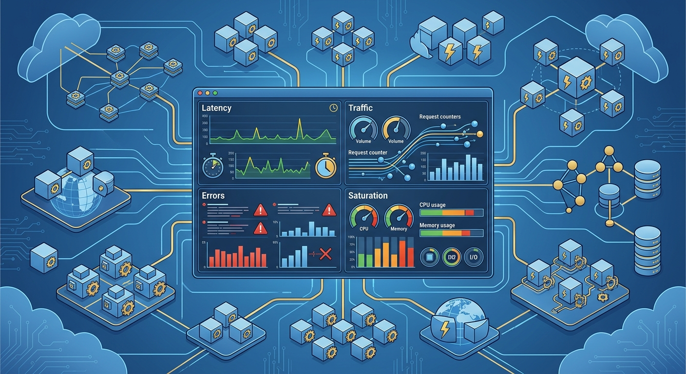
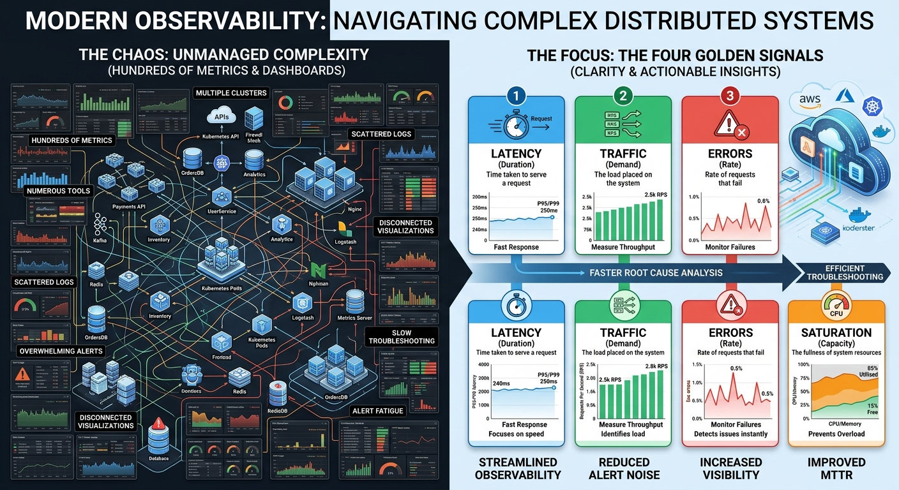
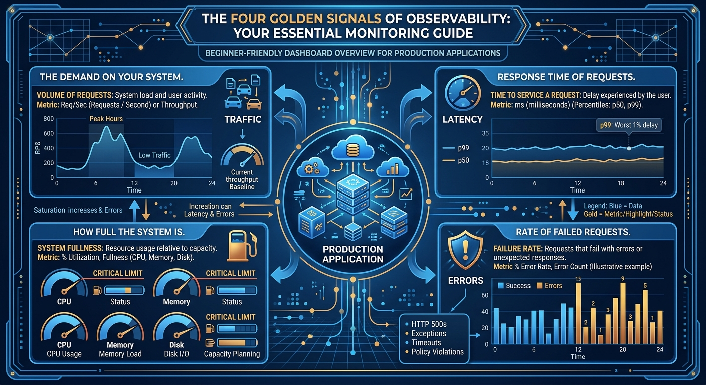
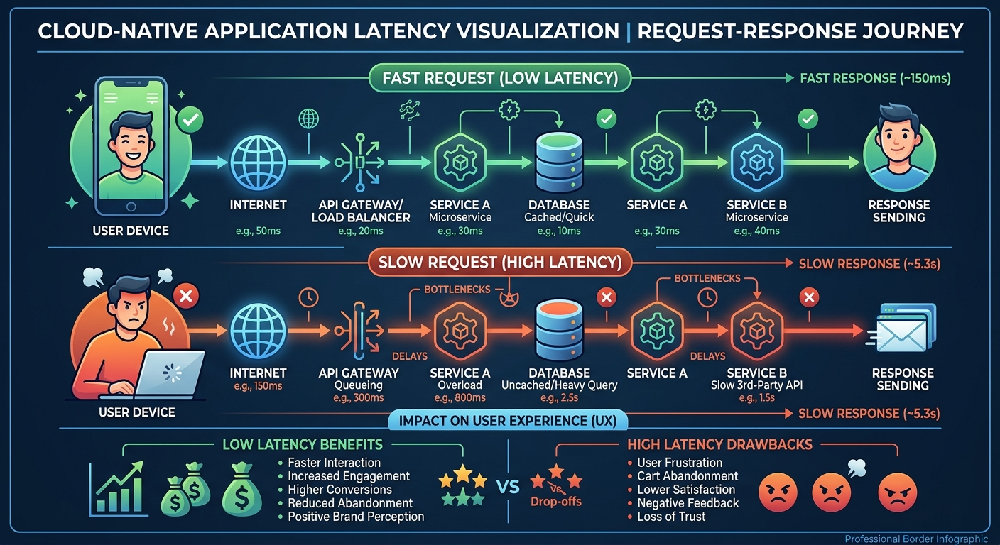
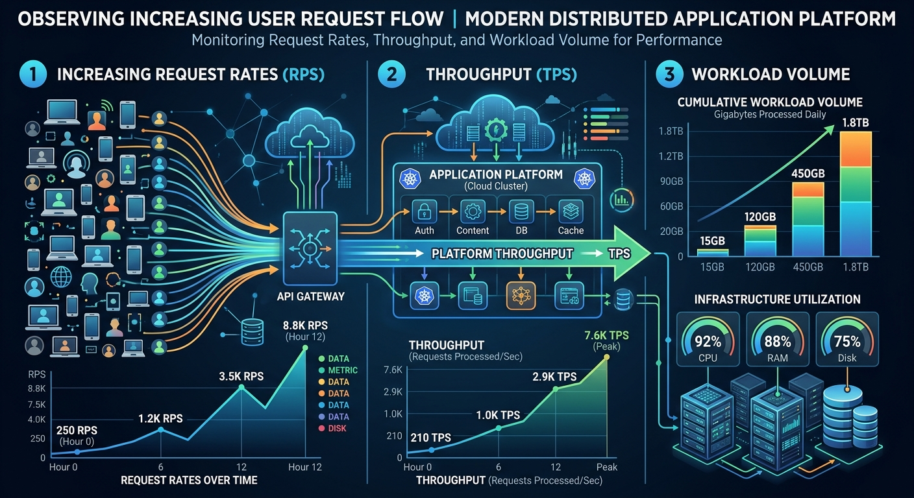
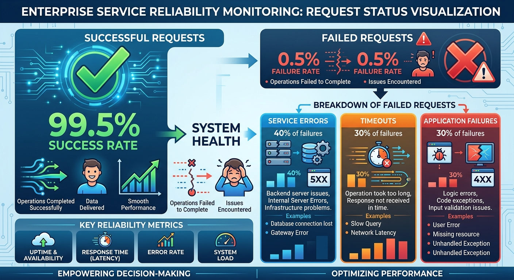
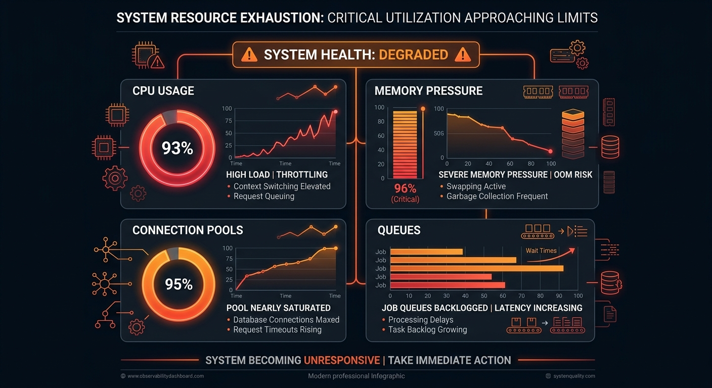
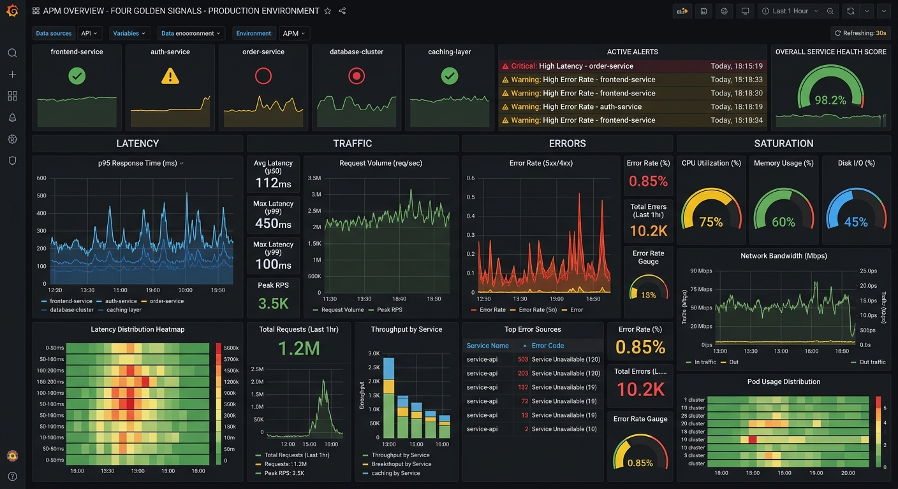

# The Four Golden Signals



# Introduction

Imagine it is 3:00 AM.

Your phone rings.

An alert has been triggered.

Users are reporting poor performance.

Leadership wants updates.

The support team is receiving complaints.

The first question every engineer asks is:

> What exactly is wrong?

Modern systems generate thousands of metrics.

CPU metrics.

Memory metrics.

Disk metrics.

Network metrics.

Application metrics.

Database metrics.

Queue metrics.

Log metrics.

The problem is that during an incident, nobody has time to look at hundreds of dashboards.

Engineers need a small set of signals that quickly answer:

> Is the system healthy?

> Are users being impacted?

> Where should we investigate first?

This is where one of the most famous concepts in Site Reliability Engineering comes in:

# The Four Golden Signals

Google popularized the idea that almost every customer-facing system can be understood through four key signals:

- Latency
- Traffic
- Errors
- Saturation

Together, these signals provide a powerful starting point for understanding system health.

---

# Why Do We Need Golden Signals?



Modern systems are incredibly complex.

A single user request may travel through:

```text
Load Balancer
      ↓
API Gateway
      ↓
Microservice
      ↓
Database
      ↓
Message Queue
      ↓
External Service
```

Hundreds of metrics may be available.

Thousands of logs may be generated.

Millions of traces may exist.

When problems occur, engineers need a way to focus quickly.

The Golden Signals help answer:

```text
Is the system responding?

How much work is arriving?

Are requests failing?

Are we approaching limits?
```

These questions form the foundation of effective monitoring.

---

# The Golden Signals at a Glance



```text
Latency
     ↓
How long does work take?

Traffic
     ↓
How much work is arriving?

Errors
     ↓
How much work is failing?

Saturation
     ↓
How close are we to capacity limits?
```

Think of these four signals as the vital signs of a production system.

Just as a doctor checks:

- Heart Rate
- Blood Pressure
- Oxygen Level
- Temperature

An SRE checks:

- Latency
- Traffic
- Errors
- Saturation

---

# Signal 1: Latency



## What Is Latency?

Latency measures:

> How long it takes to complete a request.

Simply put:

```text
Request Sent
      ↓
Response Received
```

The elapsed time is latency.

---

## Why Latency Matters

Users care deeply about responsiveness.

Imagine:

### Service A

```text
Success Rate: 100%

Response Time: 30 seconds
```

---

### Service B

```text
Success Rate: 99.9%

Response Time: 300 milliseconds
```

Most users will prefer Service B.

Fast systems feel reliable.

Slow systems often feel broken.

---

## Examples

Examples of latency measurements:

```text
API Response Time

Database Query Duration

Message Processing Duration

Job Completion Time

Page Load Time
```

---

## A Highway Analogy

Imagine a highway.

Latency represents:

```text
How long it takes a vehicle
to travel from Point A to Point B.
```

The longer the journey takes:

```text
The worse the user experience becomes.
```

---

## Warning

Average latency can be misleading.

Example:

```text
Average = 100ms
```

Looks excellent.

However:

```text
5% of requests take 10 seconds.
```

Customers still experience problems.

This is why SREs often monitor:

```text
P95 Latency

P99 Latency
```

instead of simple averages.

---

# Signal 2: Traffic



## What Is Traffic?

Traffic measures:

> How much demand the system is receiving.

Traffic answers questions such as:

```text
How many users?

How many requests?

How many transactions?

How many messages?
```

---

## Examples

Traffic metrics include:

```text
Requests Per Second

Transactions Per Minute

Messages Per Hour

Events Processed Per Day
```

---

## Why Traffic Matters

A system may work perfectly under:

```text
100 requests/second
```

and fail completely under:

```text
10,000 requests/second
```

Understanding traffic helps engineers:

- Predict growth
- Plan capacity
- Detect unusual activity
- Identify attack patterns
- Understand user behavior

---

## Highway Analogy

If latency measures journey time:

Traffic measures:

```text
How many vehicles are on the road.
```

More traffic generally means:

```text
More work for the system.
```

---

# Signal 3: Errors



## What Are Errors?

Errors measure:

> How much work is failing.

Every failed operation impacts reliability.

Examples include:

```text
HTTP 500 Responses

Failed Transactions

Database Failures

Authentication Failures

Timeouts

Message Processing Failures
```

---

## Why Errors Matter

Imagine:

```text
100,000 requests
```

received.

If:

```text
5,000 requests fail
```

then users are being impacted.

Error metrics help engineers understand:

```text
Severity

Scope

Customer Impact
```

---

## Examples

Useful error metrics:

```text
Failure Rate

Error Percentage

Failed Requests

Timeout Rate

Rejected Requests
```

---

## Highway Analogy

Imagine vehicles reaching a closed road.

Those vehicles cannot complete their journey.

This represents failed requests.

The more blocked roads exist:

```text
The larger the error rate becomes.
```

---

# Signal 4: Saturation



## What Is Saturation?

Saturation measures:

> How close a system is to its limits.

Think of saturation as an early warning signal.

A system may still appear healthy.

However, it may be approaching a breaking point.

---

## Examples

Common saturation indicators:

```text
CPU Utilization

Memory Consumption

Disk Usage

Connection Pool Usage

Queue Length

Thread Utilization
```

---

## Why Saturation Matters

Most major incidents do not happen instantly.

Warning signs often appear first.

For example:

```text
CPU rises

then response times increase

then requests fail

then outage occurs
```

Saturation helps engineers identify these warning signs before customers are heavily impacted.

---

## Highway Analogy

Imagine a highway designed for:

```text
10,000 vehicles
```

When:

```text
9,900 vehicles
```

are already using it,

the highway becomes crowded.

Traffic slows.

Delays increase.

Eventually movement stops.

This is saturation.

---

# Seeing the Signals Together



The real power of the Golden Signals comes from observing them together.

Consider this example:

```text
Latency ↑

Traffic ↑

Errors ↑

Saturation ↑
```

This often indicates:

```text
System overload.
```

---

Another example:

```text
Latency ↑

Traffic Normal

Errors Low

Saturation Low
```

Potential causes:

```text
Database Issue

Slow Dependency

Network Latency
```

---

The signals help guide investigation.

They help narrow down possible causes.

They provide context.

---

# Real-World Example

Imagine a platform processing incoming events.

Monitoring might show:

### Latency

```text
Average processing time
```

---

### Traffic

```text
Events received per minute
```

---

### Errors

```text
Failed processing attempts
```

---

### Saturation

```text
Queue backlog

CPU utilization

Consumer lag
```

Together, these measurements provide a comprehensive picture of system health.

---

# Common Mistakes

## Monitoring Only Infrastructure

Many teams focus exclusively on:

```text
CPU

Memory

Disk
```

These are useful.

But users care about service behavior.

The Golden Signals help focus on customer impact.

---

## Looking at Signals in Isolation

One metric rarely tells the entire story.

Combining all four signals provides better insight.

---

## Ignoring Saturation

Many incidents begin long before failures occur.

Saturation often provides early warning.

---

## Overcomplicating Monitoring

You do not need hundreds of dashboards to start.

The Golden Signals often uncover issues surprisingly quickly.

---

# Why the Golden Signals Matter

The Four Golden Signals provide a simple framework for understanding system health.

They help engineers:

- Detect incidents faster
- Understand customer impact
- Prioritize investigations
- Improve observability
- Build better alerts

Most importantly:

They focus attention on the metrics that matter most.

---

# Looking Ahead

The Golden Signals tell us:

```text
What is happening.
```

The next question becomes:

```text
How do we measure reliability and operational effectiveness more broadly?
```

This leads us to the next chapter:

# Important SRE Metrics

Where we will explore metrics such as:

- MTTR
- MTTD
- MTBF
- Availability
- Reliability
- Success Rate
- Operational KPIs

and understand how organizations measure the effectiveness of their reliability practices.

---

# Key Takeaways

✅ Latency measures how long work takes.

✅ Traffic measures how much work is arriving.

✅ Errors measure how much work is failing.

✅ Saturation measures how close a system is to its limits.

✅ The Four Golden Signals provide a simple framework for understanding system health.

✅ Monitoring the four signals helps detect and diagnose incidents faster.

✅ Saturation often provides early warning before outages occur.

✅ Golden Signals focus on customer-impacting system behavior.

✅ Effective observability starts with understanding these four signals.

---

> "When you don't know where to start during an incident, start with the Golden Signals."