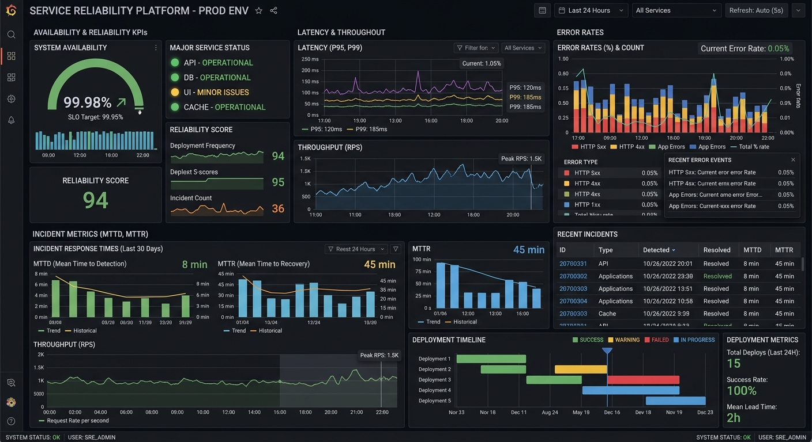
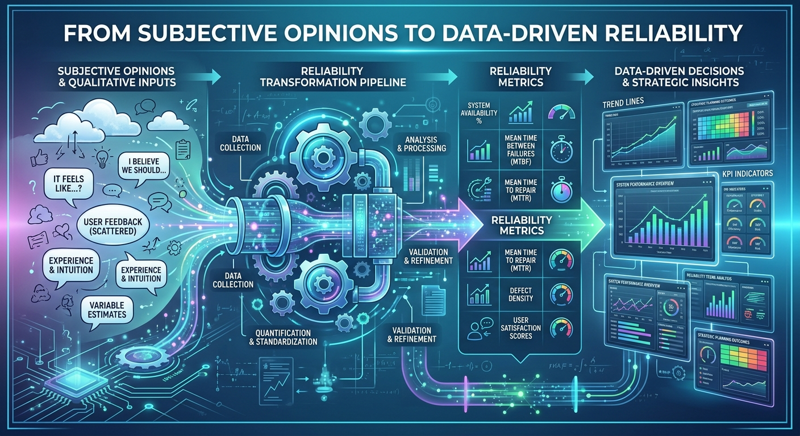
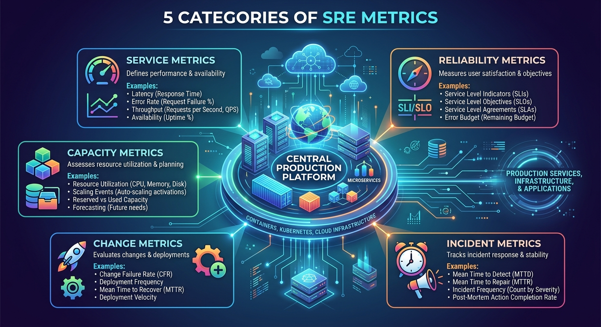
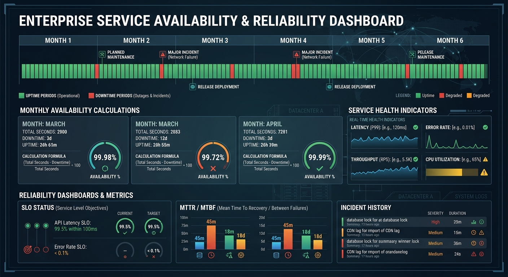
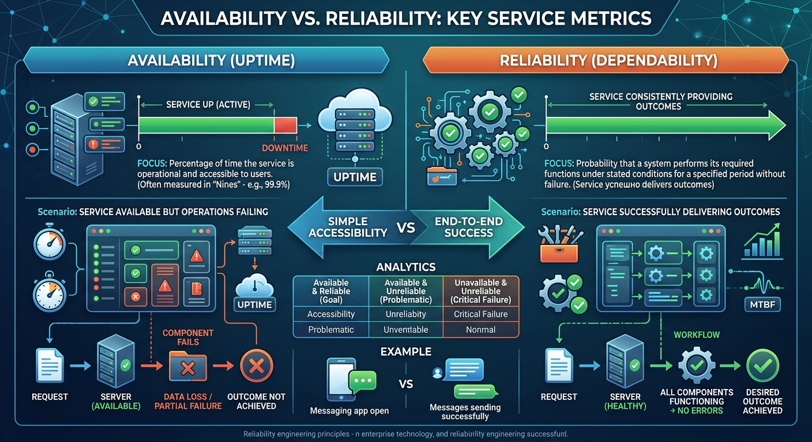
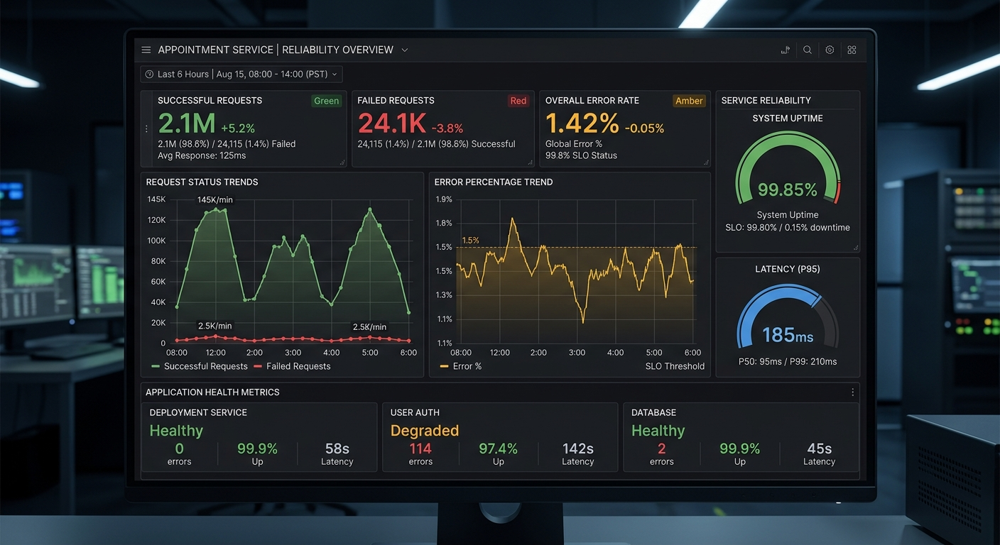
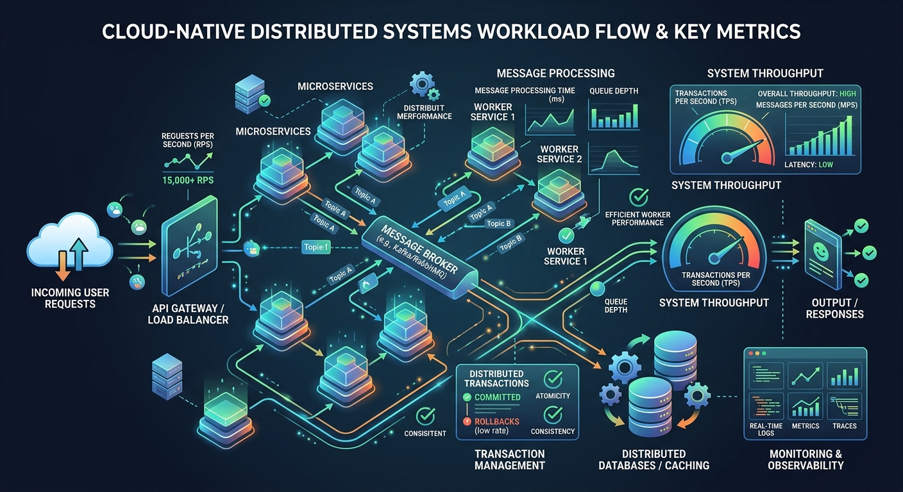
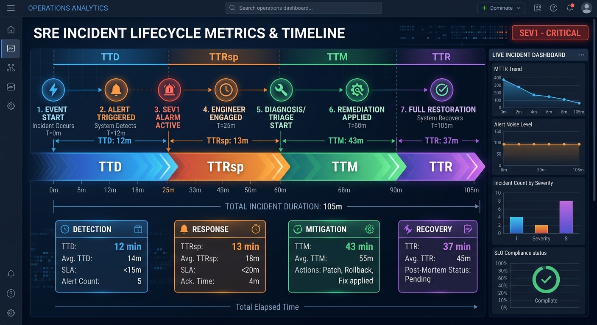
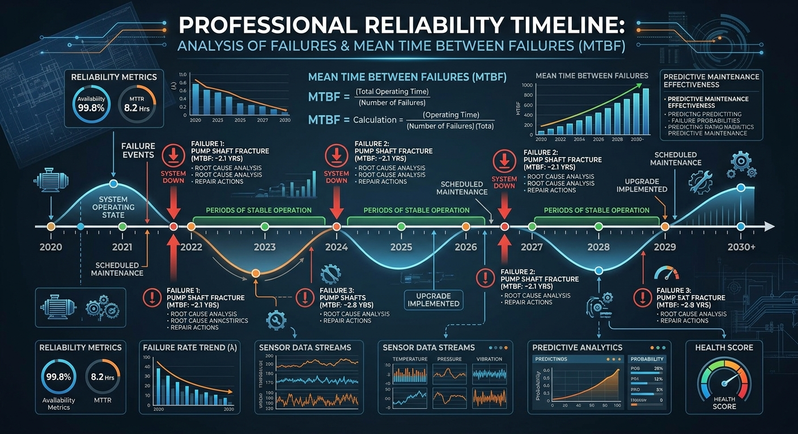
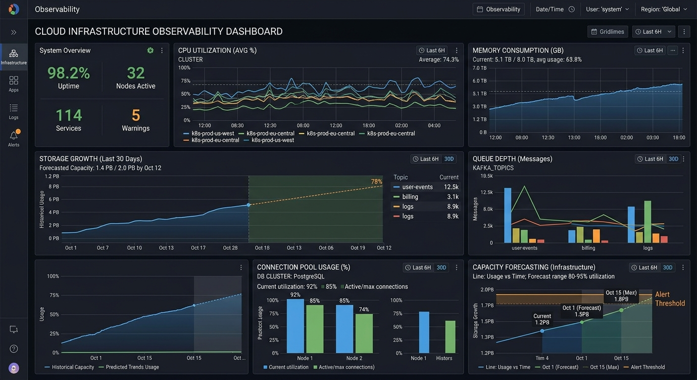

# Important SRE Metrics



# Introduction

Imagine two engineering organizations.

Both use:

- Kubernetes
- Cloud Platforms
- CI/CD Pipelines
- Monitoring Tools
- Observability Platforms

Both organizations claim:

> "We care about reliability."

One year later:

### Team A

- Incidents reduced significantly
- Recovery is faster
- Customers are happier
- Engineers are less stressed

### Team B

- Repeated outages
- Slow incident response
- Constant firefighting
- Growing operational burden

What made the difference?

One important answer is:

> Team A measured what mattered.

One of the defining characteristics of successful Site Reliability Engineering organizations is their ability to measure reliability objectively.

As we learned earlier:

```text
What gets measured gets improved.
```

However, not all metrics are equally valuable.

Some metrics create insight.

Others create noise.

This chapter explores the metrics that help SRE teams understand:

- System Health
- Reliability
- Availability
- Operational Efficiency
- Incident Response Effectiveness
- Engineering Maturity

---

# Why Metrics Matter



Imagine a product owner asks:

> "Are we becoming more reliable?"

How would you answer?

Possible responses:

```text
I think so.
```

```text
The platform feels stable.
```

```text
We haven't seen many complaints recently.
```

These answers are based on perception.

SRE prefers measurable answers.

For example:

```text
Availability improved from 99.85% to 99.95%.

MTTR reduced from 2 hours to 20 minutes.

Change Failure Rate reduced by 40%.
```

Now improvement becomes visible.

Metrics transform discussions from opinions into facts.

---

# Categories of SRE Metrics



Most SRE metrics fall into five major categories:

```text
Service Metrics

Reliability Metrics

Incident Metrics

Change Metrics

Capacity Metrics
```

Each category helps answer a different question.

---

# Service Metrics

Service Metrics help answer:

> Is the service behaving correctly?

Examples include:

- Availability
- Success Rate
- Latency
- Throughput
- Error Rate

These metrics directly impact users.

---

# Metric 1: Availability



Availability measures:

> How often a service is accessible and functioning.

---

## Formula

```text
Availability

=

Successful Time

/

Total Time
```

---

## Example

Suppose a service operates for:

```text
30 days
```

During the month it experiences:

```text
43 minutes of downtime
```

Availability:

```text
99.9%
```

---

## Why It Matters

Availability is one of the first indicators customers notice.

If users cannot access a system:

```text
Nothing else matters.
```

---

# Understanding the Famous Nines

SRE discussions often involve "nines".

---

## Two Nines

```text
99%
```

Downtime per year:

```text
~3.65 days
```

---

## Three Nines

```text
99.9%
```

Downtime per year:

```text
~8.76 hours
```

---

## Four Nines

```text
99.99%
```

Downtime per year:

```text
~52.6 minutes
```

---

## Five Nines

```text
99.999%
```

Downtime per year:

```text
~5.26 minutes
```

Higher availability is possible.

It is also considerably more expensive.

---

# Metric 2: Reliability



Availability and reliability are often confused.

They are not identical.

---

A service can be:

```text
Available
```

but still

```text
Unreliable
```

Example:

The system responds.

However:

- Transactions fail
- Jobs fail
- Requests timeout
- Data is incorrect

The service is technically available.

Users still experience problems.

---

Reliability typically focuses on:

```text
Successful outcome delivery.
```

Examples:

```text
Successful Requests %

Successful Jobs %

Successful Transactions %

Successful Processing Events %
```

---

# Metric 3: Latency

We introduced latency in the Golden Signals chapter.

It remains one of the most important service metrics.

Questions latency answers:

```text
How quickly is work completed?
```

Examples:

```text
API Response Time

Search Duration

Database Query Time

Job Processing Time
```

---

## Why Latency Matters

Users often perceive:

```text
Slow
```

as

```text
Broken
```

Monitoring latency helps identify:

- Performance degradation
- Bottlenecks
- Capacity constraints
- Dependency issues

---

# Metric 4: Error Rate



Error Rate measures:

> How much work is failing.

Example:

```text
100,000 Requests

500 Failures
```

---

Error Rate:

```text
0.5%
```

---

Useful error metrics include:

```text
HTTP 500 Rate

Failed Transactions

Timeout Percentage

Job Failure Rate
```

---

# Metric 5: Throughput



Throughput measures:

> How much work a system can process.

Examples:

```text
Requests Per Second

Messages Per Minute

Transactions Per Hour

Events Processed Per Day
```

---

Throughput helps organizations understand:

- System capacity
- Traffic growth
- Scaling requirements

---

# Incident Metrics



Service metrics describe system behavior.

Incident metrics describe operational effectiveness.

---

# Metric 6: MTTD

## Mean Time To Detect

MTTD answers:

> How long does it take to discover a problem?

Example:

```text
Issue Begins

10:00 AM
```

Detected:

```text
10:20 AM
```

MTTD:

```text
20 Minutes
```

---

## Why MTTD Matters

The sooner problems are detected:

```text
The sooner recovery can begin.
```

Good observability reduces MTTD significantly.

---

# Metric 7: MTTR

## Mean Time To Recover

One of the most important SRE metrics.

MTTR answers:

> How long does it take to restore service?

---

Example:

```text
Service Fails

10:00 AM
```

Service Restored:

```text
10:30 AM
```

MTTR:

```text
30 Minutes
```

---

## Why MTTR Matters

Customers care less about:

```text
How impressive the RCA was.
```

and more about:

```text
How quickly service was restored.
```

Reducing MTTR is often one of the highest-value investments an SRE team can make.

---

# Metric 8: MTBF



## Mean Time Between Failures

MTBF answers:

> How frequently do failures occur?

Example:

```text
Failure
     ↓
90 Days
     ↓
Failure
```

---

MTBF:

```text
90 Days
```

---

Higher MTBF generally indicates:

- Better stability
- Better reliability
- Fewer recurring issues

---

# Change Metrics

One of the biggest lessons from modern reliability engineering is:

> Most outages are caused by change.

For this reason, elite engineering organizations measure deployment quality carefully.

---

# Metric 9: Change Failure Rate


Change Failure Rate measures:

> How often deployments cause production issues.

Example:

```text
100 Deployments
```

Failures:

```text
8
```

---

Change Failure Rate:

```text
8%
```

---

A lower value generally indicates:

- Safer deployments
- Better testing
- Better release processes

---

# Metric 10: Deployment Frequency

Deployment Frequency measures:

> How often teams successfully release changes.

Examples:

```text
Monthly

Weekly

Daily

Multiple Times Per Day
```

---

Healthy organizations aim for:

```text
Frequent

Low-Risk

Automated

Repeatable
```

deployments.

---

# Capacity Metrics



Capacity metrics answer:

> How close are we to our limits?

Examples include:

```text
CPU Utilization

Memory Usage

Storage Usage

Connection Pool Usage

Queue Depth

Consumer Lag
```

These metrics help identify growth-related risks before they become incidents.

---

# Metrics That Matter Most

If an SRE had to start with just a few metrics, these would be strong candidates:

```text
Availability

Latency

Error Rate

Throughput

MTTD

MTTR

Change Failure Rate

Deployment Frequency
```

These metrics provide visibility into both:

```text
System Health
```

and

```text
Operational Effectiveness
```

---

# Common Mistakes

## Collecting Everything

More metrics do not automatically create more insight.

Focus on actionable metrics.

---

## Measuring Infrastructure Only

Customers care about outcomes.

Not CPU graphs.

Monitor what matters to users.

---

## Ignoring Trends

Individual values are useful.

Trends over time are often more valuable.

---

## Using Metrics Without Action

Metrics should drive:

- Investigation
- Improvement
- Learning

Not just dashboard creation.

---

# Building a Metrics-Driven Culture

The ultimate goal of SRE metrics is not reporting.

The goal is improvement.

Strong SRE organizations use metrics to:

- Improve reliability
- Reduce incidents
- Increase automation
- Improve operational efficiency
- Enhance customer experience

Metrics provide the feedback loop that makes continuous improvement possible.

---

# Looking Ahead

Now we understand:

- Reliability
- Error Budgets
- Golden Signals
- Operational Metrics

The next logical question becomes:

> Before a service enters production, how can we determine whether it is truly ready?

This leads us to our next chapter:

# Production Readiness

Where we will discuss how successful SRE organizations evaluate systems before they become production responsibilities.

---

# Key Takeaways

✅ Metrics transform opinions into measurable outcomes.

✅ Availability measures uptime.

✅ Reliability measures successful customer outcomes.

✅ Latency measures responsiveness.

✅ Error Rate measures failed work.

✅ Throughput measures workload volume.

✅ MTTD measures detection speed.

✅ MTTR measures recovery speed.

✅ MTBF measures stability.

✅ Change Failure Rate measures deployment quality.

✅ The best SRE teams use metrics to drive continuous improvement.

---

> "You cannot improve what you do not measure, and you cannot measure everything. Choose wisely."