# Production Readiness

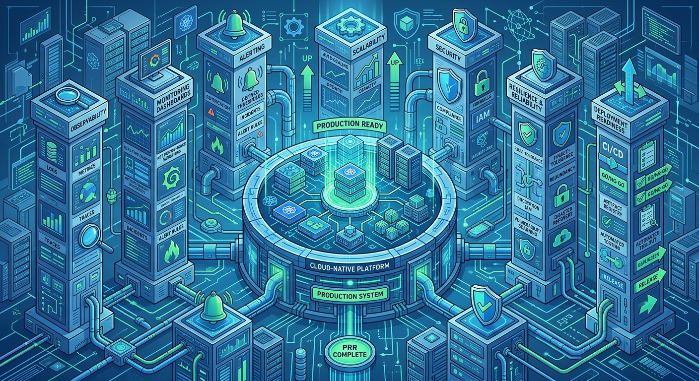

# Introduction

A development team has spent months building a new service.

The architecture review is complete.

The functionality has been tested.

The user interface looks great.

The APIs work exactly as expected.

Everyone is excited.

The team wants to move the service into production.

Then an experienced SRE asks a simple question:

> "What happens when this service fails?"

The room becomes quiet.

Another question follows:

> "How will we know it has failed?"

And another:

> "Who is responsible for fixing it?"

Suddenly, the conversation changes.

The focus shifts from:

```text
Can this service work?
```

to:

```text
Can this service survive in production?
```

This is the essence of Production Readiness.

---

# Why Production Readiness Matters

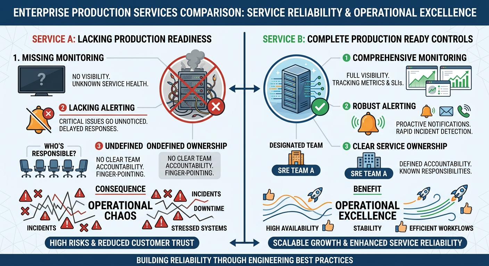

Many incidents are not caused by bad code.

They are caused by missing operational preparation.

Examples include:

- No monitoring
- No alerting
- Missing dashboards
- Missing runbooks
- Poor scaling design
- Undefined ownership
- Untested recovery procedures

From a functionality perspective, the service works perfectly.

From an operational perspective, the service is a disaster waiting to happen.

Production Readiness exists to prevent these situations.

---

# What Is Production Readiness?

Production Readiness is the process of determining whether a service can be operated safely, reliably, and sustainably in a production environment.

A Production Readiness Review (PRR) asks questions such as:

- Can we monitor this service?
- Can we detect failures quickly?
- Can we recover quickly?
- Can the service handle growth?
- Is ownership clearly defined?
- Are operational procedures documented?

Production Readiness is not about proving that software works.

It is about proving that software can be operated reliably.

---

# The Difference Between "Working" and "Production Ready"

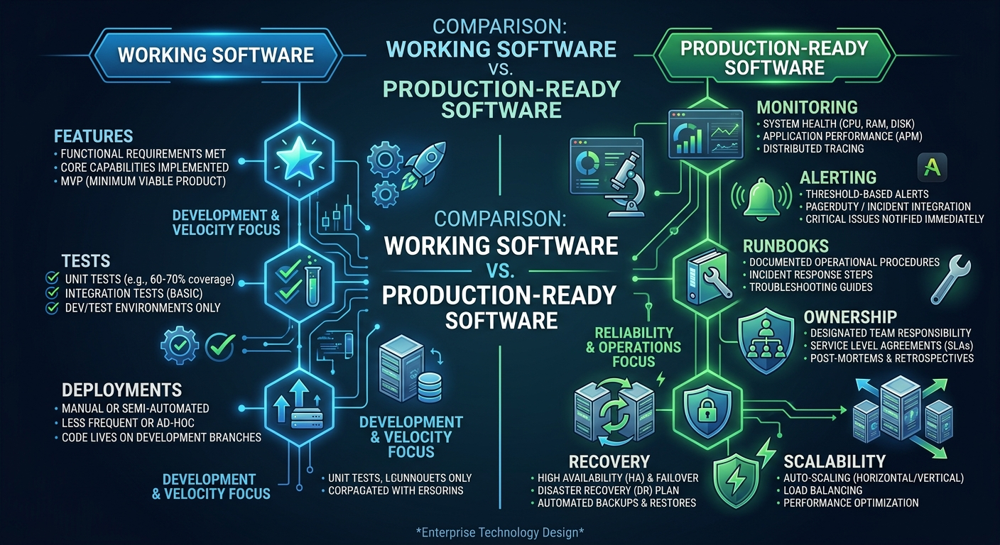

Imagine two services.

### Service A

```text
Features Completed

Tests Passed

Application Deploys Successfully
```

---

### Service B

```text
Features Completed

Tests Passed

Monitoring Implemented

Alerting Configured

Dashboards Built

Runbooks Available

Ownership Defined

Recovery Procedures Tested
```

Both services work.

Only one is truly production ready.

---

# The Production Readiness Mindset

A production-ready system assumes:

```text
Failures will occur.
```

Questions that guide SRE thinking include:

```text
How do we detect failure?

How do we recover?

How do we scale?

How do we troubleshoot?

How do we prevent recurrence?
```

If the answer to these questions is unclear, more work is usually required before production deployment.

---

# Pillar 1: Service Ownership

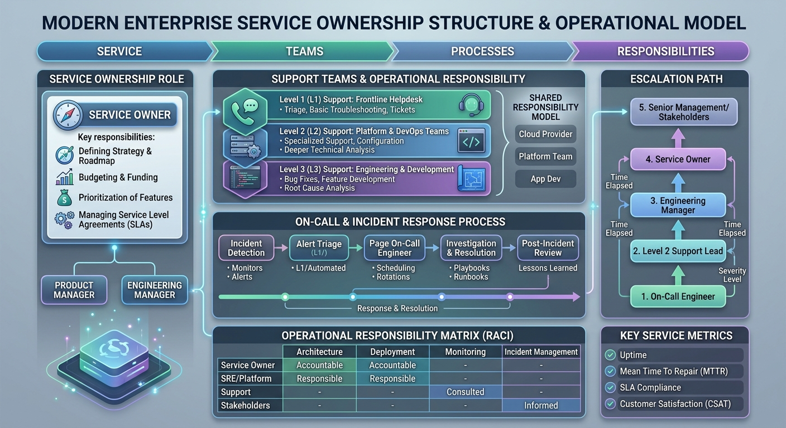

One of the most important questions in production:

> Who owns this service?

A surprising number of incidents become difficult because nobody clearly owns the affected system.

Every production service should have:

### Clear Ownership

```text
Primary Team

Secondary Team

Escalation Path
```

---

### Contact Information

```text
On-call Team

Support Channel

Incident Escalation Process
```

---

### Responsibilities

Ownership includes:

- Monitoring
- Alerting
- Maintenance
- Incident Response
- Continuous Improvement

Ownership must be defined before a service reaches production.

---

# Pillar 2: Observability

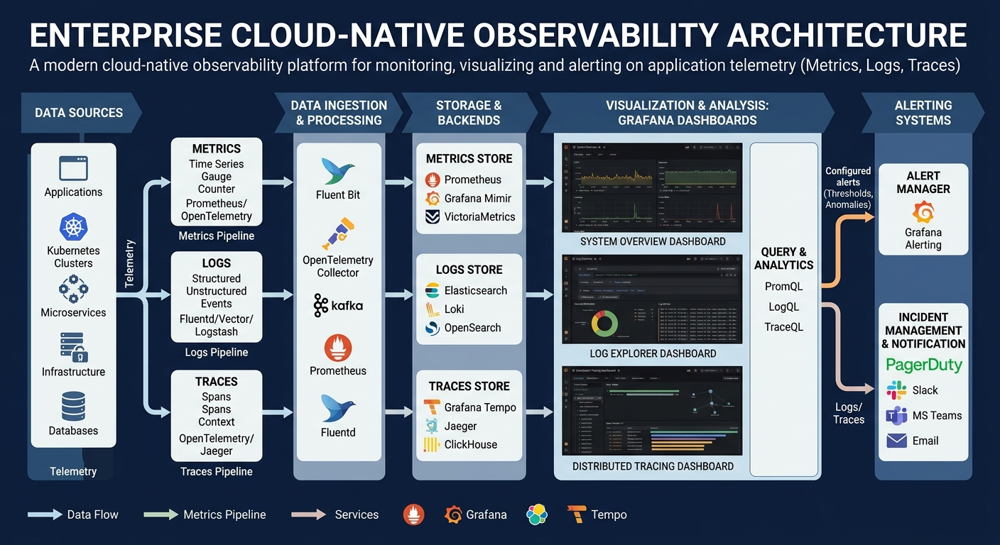

If a service fails but nobody knows it has failed:

```text
The service is not production ready.
```

Production readiness requires observability.

At minimum, a service should provide:

### Metrics

Examples:

```text
Request Rate

Response Time

Success Rate

Error Rate
```

---

### Logs

Examples:

```text
Application Logs

Audit Logs

Operational Logs
```

---

### Traces

Examples:

```text
Request Flow

Dependency Calls

Latency Analysis
```

Observability enables engineers to understand system behavior during incidents.

---

# Pillar 3: Monitoring and Alerting

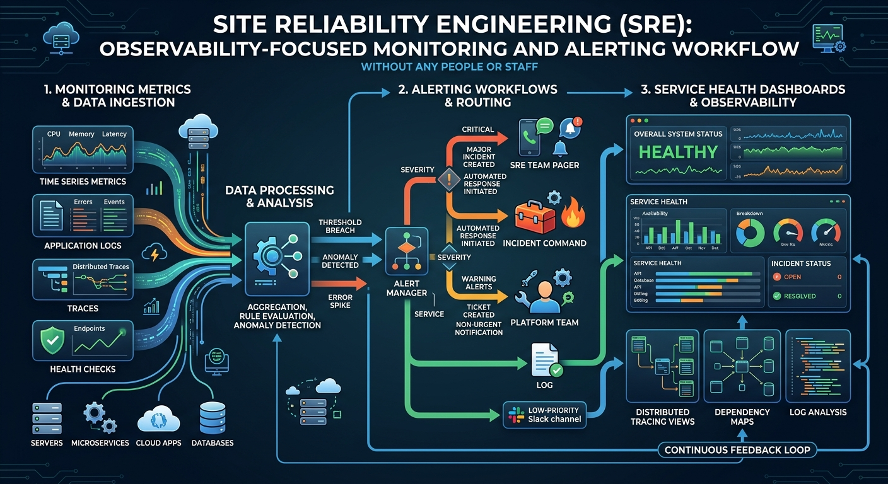

Monitoring without alerting is incomplete.

Alerting without meaningful monitoring is ineffective.

Good production services can answer:

```text
What should be monitored?

What should generate alerts?

Who receives alerts?

How will alerts be handled?
```

---

## Example

Poor Alert:

```text
CPU > 80%
```

---

Better Alert:

```text
Request Success Rate below SLO

AND

Customer traffic affected
```

Good alerts should be:

- Actionable
- Meaningful
- Relevant

---

# Pillar 4: Runbooks

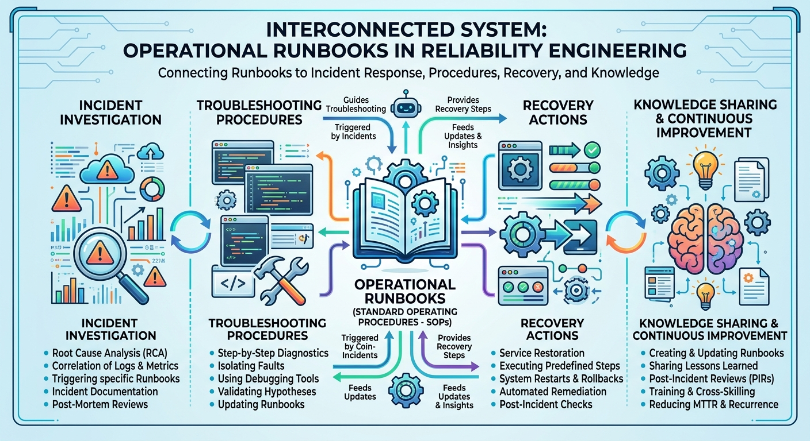

Imagine a critical service begins failing.

An alert fires.

An engineer receives the notification.

What happens next?

Without documentation:

```text
Engineer investigates from scratch.
```

With a runbook:

```text
Known investigation steps.

Known validation steps.

Known recovery actions.
```

Runbooks reduce:

- MTTR
- Confusion
- Stress during incidents

Every production service should have at least one operational runbook.

---

# Pillar 5: Scalability

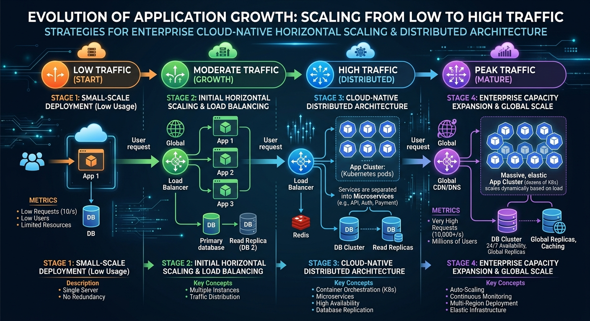

A service may work perfectly with:

```text
1,000 requests/day
```

but fail completely at:

```text
1,000,000 requests/day
```

Production Readiness requires understanding:

- Expected growth
- Capacity limits
- Performance bottlenecks
- Scaling strategies

Questions include:

```text
Can the service scale horizontally?

Can databases scale?

Can queues handle the load?

Can infrastructure grow with demand?
```

Growth should never come as a surprise.

---

# Pillar 6: Resilience

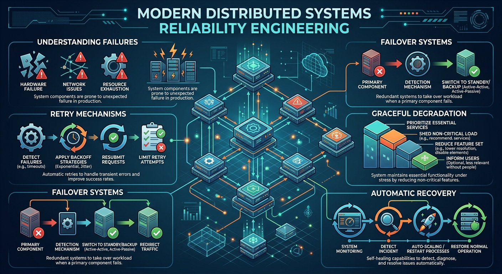

Resilience answers:

> What happens when something goes wrong?

Examples:

```text
Database outage

Dependency timeout

Network disruption

Cloud service interruption
```

---

Questions:

```text
Can the service recover automatically?

Is there a failover strategy?

Can requests be retried safely?

Is graceful degradation possible?
```

Production systems should expect failures and survive them.

---

# Pillar 7: Backup and Recovery

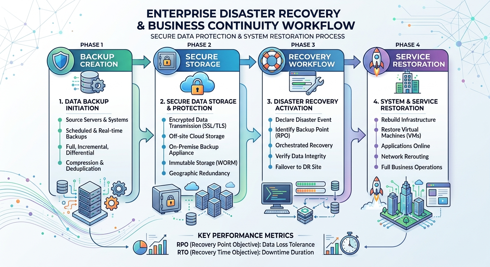

Most teams verify backups.

Fewer teams verify recovery.

The real question is:

> Can we actually restore the service?

A backup has little value if recovery procedures are unknown.

Production readiness requires:

### Backup Strategy

```text
Data Backup

Configuration Backup

Infrastructure Backup
```

---

### Recovery Validation

```text
Backup Restoration Testing

Recovery Time Validation

Recovery Documentation
```

---

# Pillar 8: Security Readiness

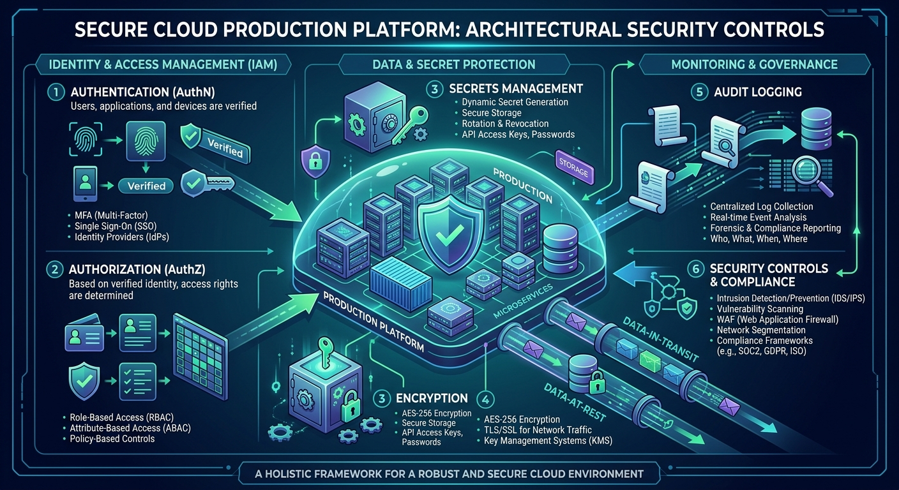

Security and reliability are closely connected.

A vulnerable service often becomes an unreliable service.

Production Readiness should verify:

```text
Authentication

Authorization

Secrets Management

Encryption

Audit Logging
```

Security cannot be an afterthought.

---

# Pillar 9: Deployment Readiness

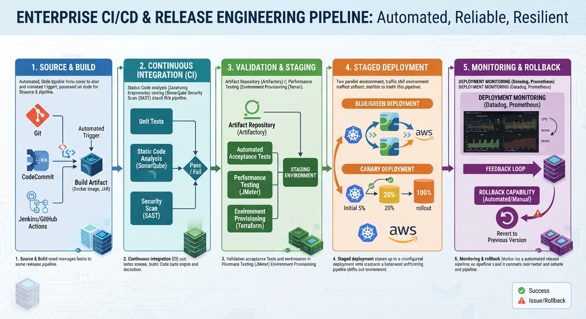

Deployments are one of the most common sources of production incidents.

Questions include:

```text
Can deployments be automated?

Can deployments be rolled back?

Can deployments be monitored?

Can deployments be validated?
```

Healthy production systems make deployment safe, repeatable, and predictable.

---

# Pillar 10: Disaster Recovery

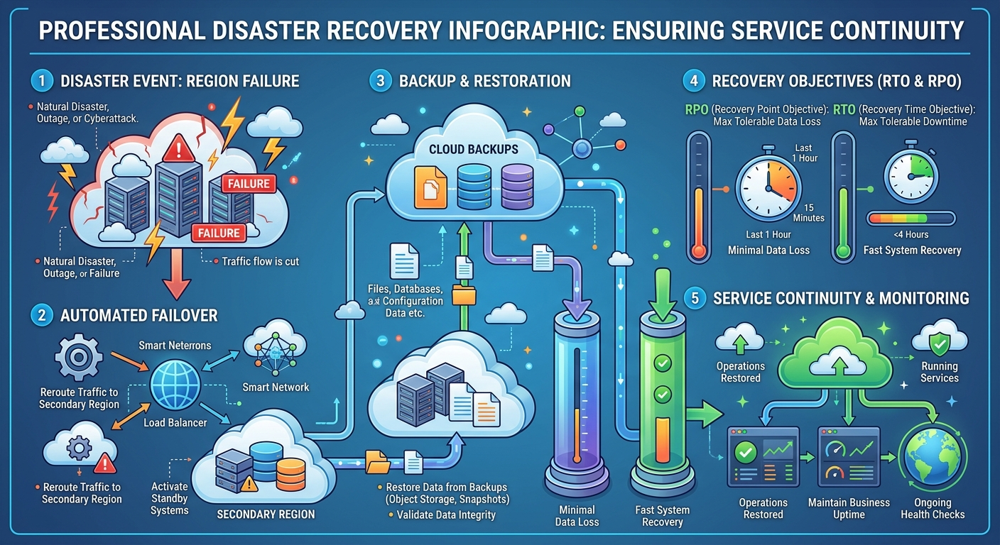

Sometimes failures are larger than individual incidents.

Examples:

- Region failure
- Major infrastructure outage
- Data corruption
- Widespread service disruption

Questions include:

```text
What is our recovery strategy?

What is our recovery objective?

Has recovery been tested?
```

A disaster recovery plan that exists only on paper is not enough.

---

# Production Readiness Checklist

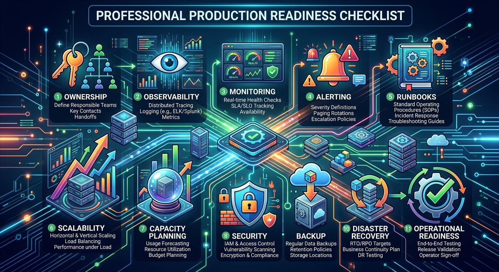

Before production deployment, ask:

### Ownership

✅ Service owner identified

✅ Escalation path documented

---

### Observability

✅ Metrics available

✅ Logs available

✅ Traces available

---

### Monitoring

✅ Critical alerts configured

✅ Dashboard created

---

### Operations

✅ Runbooks documented

✅ On-call process defined

---

### Reliability

✅ Failure scenarios reviewed

✅ Recovery procedures tested

---

### Capacity

✅ Performance testing completed

✅ Scaling strategy documented

---

### Security

✅ Security review completed

✅ Secrets properly managed

---

### Resilience

✅ Backup strategy validated

✅ Disaster recovery plan available

---

# What Mature Organizations Understand

Mature engineering organizations understand:

```text
Production is a product.
```

It requires:

- Design
- Planning
- Testing
- Ownership
- Continuous Improvement

Production readiness is not a gate designed to slow teams down.

It is a safety mechanism designed to help teams succeed.

The earlier readiness is considered, the fewer surprises occur later.

---

# Common Mistakes

## "We'll Add Monitoring Later"

Monitoring added after production deployment is usually too late.

---

## "We'll Create Runbooks After the First Incident"

The first incident is exactly when the runbook is needed.

---

## "The Service Worked During Testing"

Testing validates functionality.

Production readiness validates operability.

---

## "We Have Backups"

Can you restore?

That is the real question.

---

# Looking Ahead

We've now covered:

- Reliability Principles
- SLI, SLO, SLA
- Error Budgets
- Toil Reduction
- Golden Signals
- Important SRE Metrics
- Production Readiness

The final chapter of the fundamentals section explores several popular misconceptions about Site Reliability Engineering.

# Common SRE Misconceptions

Understanding these misconceptions is important because many organizations unintentionally misuse or misunderstand the purpose of SRE.

---

# Key Takeaways

✅ Working software is not automatically production ready.

✅ Production readiness focuses on operability, reliability, and sustainability.

✅ Every service needs clear ownership.

✅ Observability must exist before incidents occur.

✅ Monitoring and alerting are critical production requirements.

✅ Runbooks reduce confusion and improve recovery speed.

✅ Scalability should be evaluated before growth creates problems.

✅ Disaster recovery plans must be tested, not just documented.

✅ Production Readiness Reviews help identify risks before customers encounter them.

---

> "If a service cannot be operated reliably, it is not truly production ready."