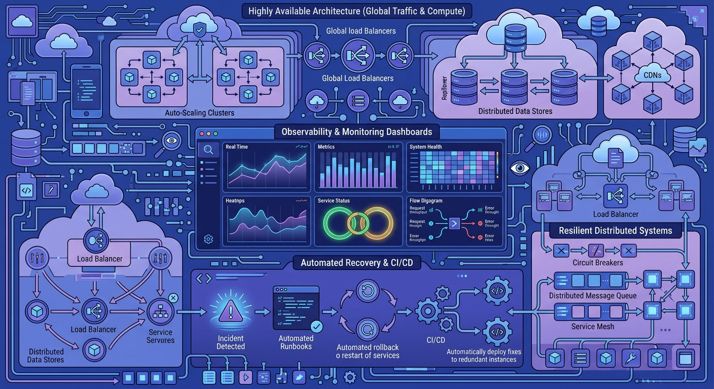
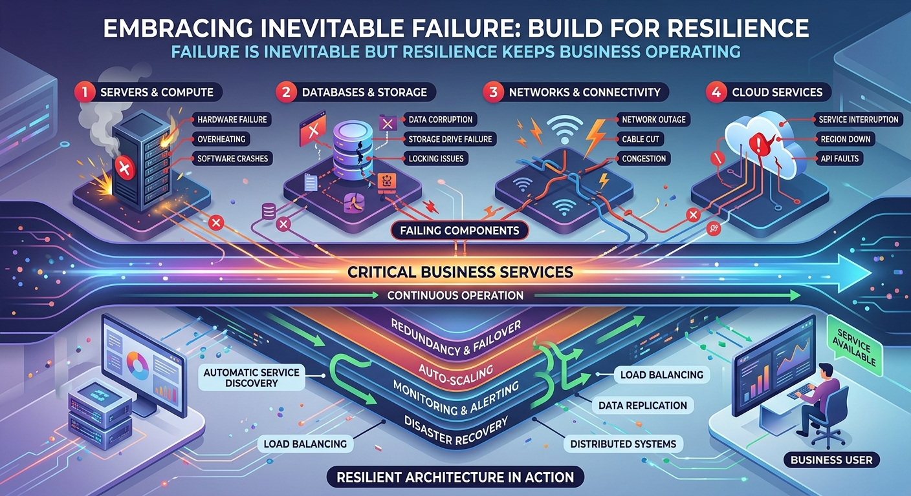
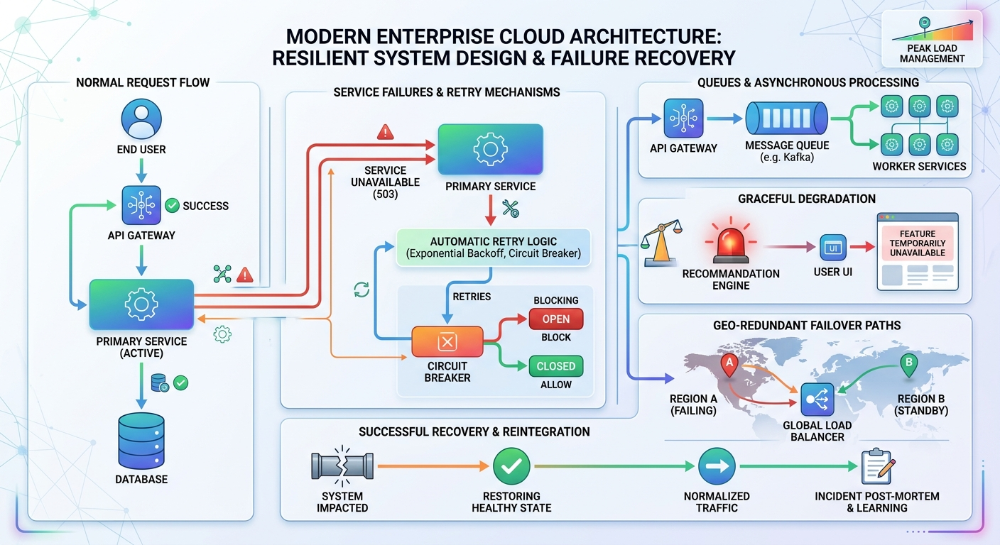
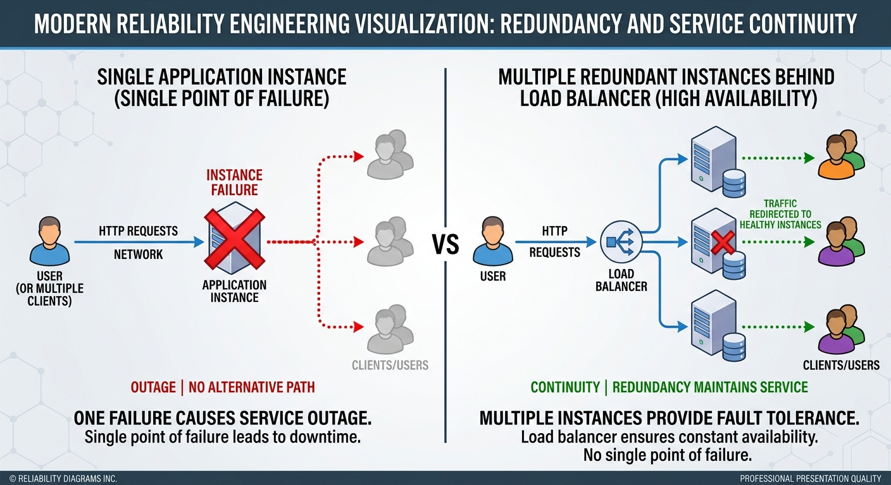
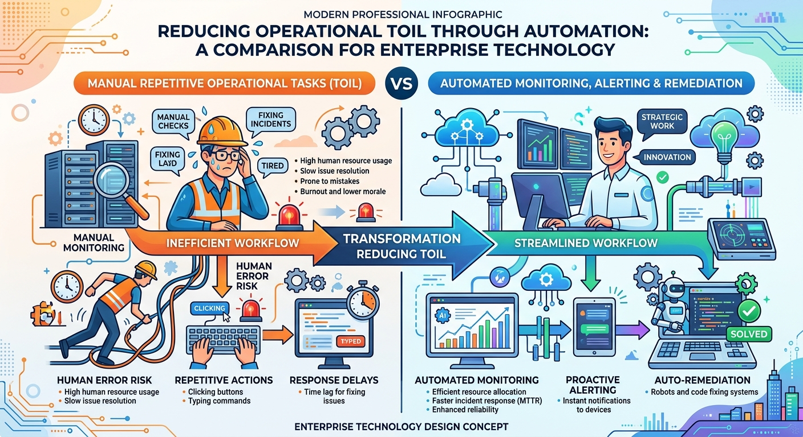
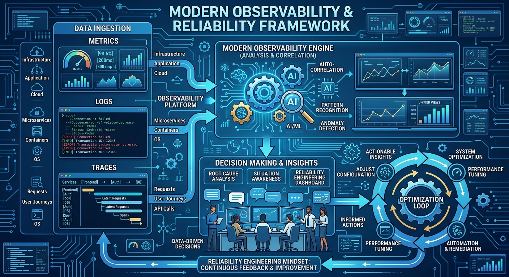
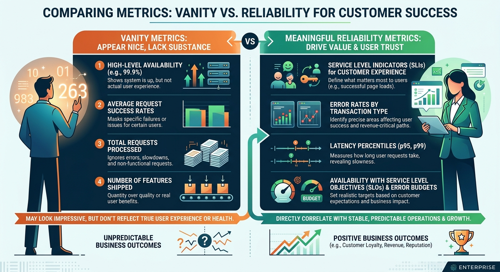
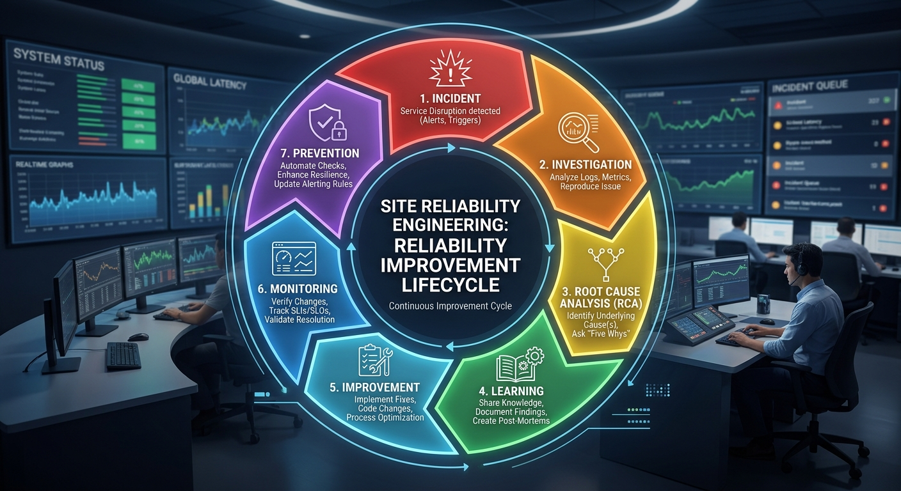

# Reliability Principles



# Introduction

Imagine you are responsible for a critical production platform.

Everything appears healthy.

Dashboards are green.

No alerts are firing.

Users are happy.

Then, without warning:

- A server crashes.
- A database becomes unavailable.
- A network link fails.
- A cloud service experiences an outage.
- A deployment introduces an unexpected issue.

Suddenly, everything changes.

Many engineers view these situations as exceptions.

Site Reliability Engineers view them as inevitable.

One of the most important mindset shifts in Site Reliability Engineering is understanding that:

> Failure is not an exception.
>
> Failure is a normal part of operating complex systems.

Reliability Engineering is not about pretending failures will never happen.

It is about designing systems that continue to provide value when failures inevitably occur.

---

# Why Reliability Matters

Reliability is often misunderstood.

Many people think reliability means:

```text
No outages
```

In reality, reliability means:

```text
The ability of a system to continue delivering value when things go wrong.
```

A reliable system is not a system that never fails.

A reliable system is a system that:

- Detects problems quickly
- Recovers quickly
- Minimizes customer impact
- Learns and improves continuously

---

# Principle 1: Accept That Failure Is Inevitable



The first principle of Reliability Engineering is surprisingly simple:

> Things will fail.

Servers fail.

Applications fail.

Networks fail.

Databases fail.

Cloud services fail.

Humans make mistakes.

Dependencies become unavailable.

Many production incidents occur because systems were designed assuming everything would work perfectly.

Unfortunately, production environments are rarely perfect.

Instead of asking:

> "How do we stop failures from happening?"

SREs often ask:

> "What happens when failure occurs?"

That small change in thinking leads to much better system design.

---

## Real World Example

Imagine a service that processes incoming events.

A traditional approach may assume:

```text
Database is always available.
```

A Reliability Engineering approach assumes:

```text
Database may become unavailable at any time.
```

The system can then be designed to:

- Retry requests
- Queue work temporarily
- Fail gracefully
- Recover automatically

---

# Principle 2: Design for Failure



This principle is known as:

> Design for Failure

Instead of assuming components will always work, reliability engineers assume components can fail at any moment.

Questions an SRE often asks:

- What happens if this service becomes unavailable?
- What happens if this database stops responding?
- What happens if a dependency is slow?
- What happens if a message is processed twice?
- What happens if a deployment fails?

The goal is not to eliminate risk.

The goal is to reduce impact.

---

## Simple Example

Consider two systems.

### System A

```text
Application
      ↓
Database
```

If the database fails:

```text
Entire application fails.
```

---

### System B

```text
Application
      ↓
Cache
      ↓
Database
```

If the database becomes temporarily unavailable:

```text
Application may continue serving cached data.
```

This design is more resilient.

---

# Principle 3: Eliminate Single Points of Failure



A Single Point of Failure (SPOF) is a component whose failure causes the entire system to stop functioning.

For example:

```text
Load Balancer
      ↓
Application
```

If there is only one application instance and it crashes:

```text
Service unavailable
```

A better design might be:

```text
Load Balancer
      ↓
 ┌─────────┐
 │ App #1  │
 │ App #2  │
 │ App #3  │
 └─────────┘
```

Now the failure of one instance does not impact the entire service.

---

## Common Single Points of Failure

- Single application instance
- Single database server
- Single network path
- Single message broker
- Single storage system
- Single monitoring platform

Reliability engineering aims to remove or reduce these risks wherever possible.

---

# Principle 4: Automate Repetitive Work



One of the reasons SRE was created was to reduce repetitive operational work.

This repetitive work is often called:

> Toil

Examples of toil:

- Checking system health manually
- Restarting services repeatedly
- Collecting logs manually
- Running the same diagnostic commands every day
- Creating identical reports repeatedly

The problem with toil is that it does not scale.

As systems grow, manual work grows too.

Automation helps engineers focus on solving problems instead of repeatedly reacting to them.

---

## Example

### Manual Approach

```text
Engineer checks 50 services every morning.
```

### Automated Approach

```text
Monitoring platform checks services continuously.

Alerts are generated automatically if issues are detected.
```

The automated approach is faster, more reliable, and more scalable.

---

# Principle 5: Observe Before Optimizing



Many engineering mistakes happen because teams jump directly to solutions.

Example:

```text
CPU utilization is high.
```

Immediate reaction:

```text
Add more CPU.
```

But what if CPU is not the real problem?

A good reliability engineer investigates before acting.

Questions include:

- Why is CPU utilization high?
- Which service is causing it?
- Is it normal traffic?
- Is there a memory leak?
- Is there an inefficient query?
- Is a dependency failing?

Observability helps answer these questions.

This is why SREs often say:

> Measure first. Optimize second.

---

# Principle 6: Measure What Matters



Many teams measure things that are easy to collect rather than things that matter.

For example:

```text
Number of servers
```

This number alone provides limited value.

A better measurement might be:

```text
Successful customer operations
```

Or:

```text
Request Success Rate
```

Or:

```text
Response Time
```

Reliability engineering focuses on metrics that reflect customer experience and business value.

---

# Principle 7: Reliability Is a Feature

One common mistake is treating reliability as an afterthought.

Imagine two products:

### Product A

```text
100 features

70% reliability
```

### Product B

```text
20 features

99.99% reliability
```

Most users will trust Product B.

Features create value.

Reliability protects that value.

Without reliability, even the best features become difficult to use.

This is why many organizations view reliability as a product feature.

---

# Principle 8: Learn from Failure



Every production incident tells a story.

A traditional approach might be:

```text
Fix problem.
Move on.
```

A Reliability Engineering approach is:

```text
Fix problem.
Understand problem.
Learn from problem.
Improve system.
```

This is why post-incident reviews and Root Cause Analyses (RCAs) are so important.

The objective is not blame.

The objective is learning.

Every incident is an opportunity to make the system stronger.

---

# Reliability Mindset Summary

Successful SREs often think differently from traditional operators.

Instead of asking:

```text
How do we prevent failure forever?
```

They ask:

```text
How do we detect failure quickly?

How do we reduce impact?

How do we recover faster?

How do we prevent similar failures in the future?
```

This mindset creates systems that are more resilient, scalable, and reliable.

---

# Key Takeaways

✅ Failure is inevitable.

✅ Reliable systems are designed to tolerate failure.

✅ Single Points of Failure should be minimized.

✅ Automation is preferred over repetitive manual work.

✅ Observability should guide optimization decisions.

✅ Measure outcomes that matter to users.

✅ Reliability is a feature.

✅ Every incident is an opportunity to learn and improve.

---

> "The question is not whether a system will fail. The question is how well it recovers when it does."