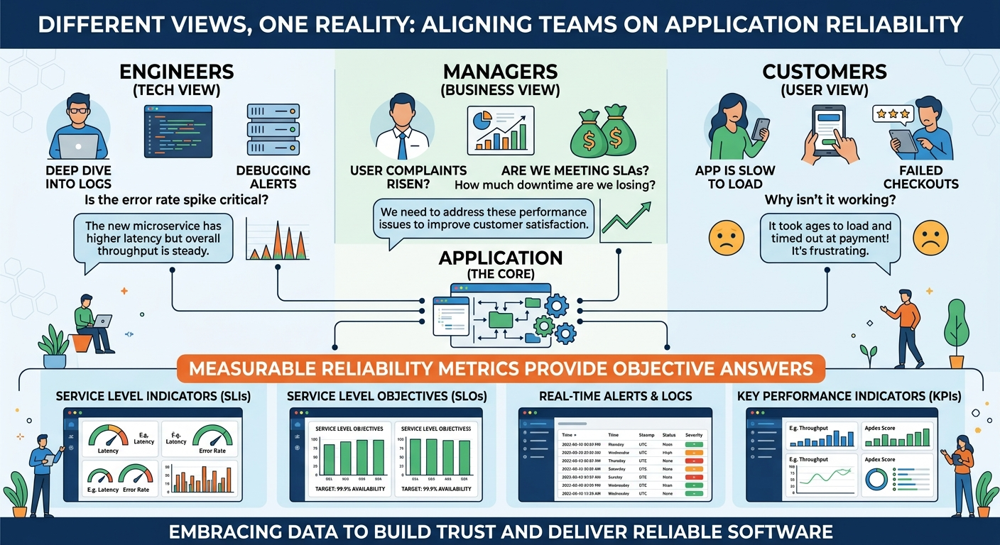
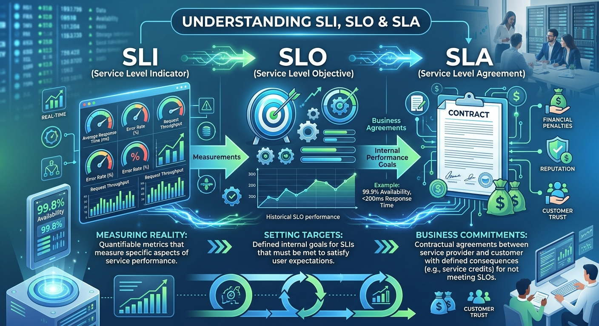
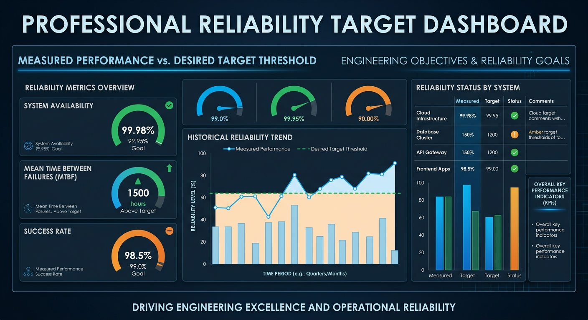
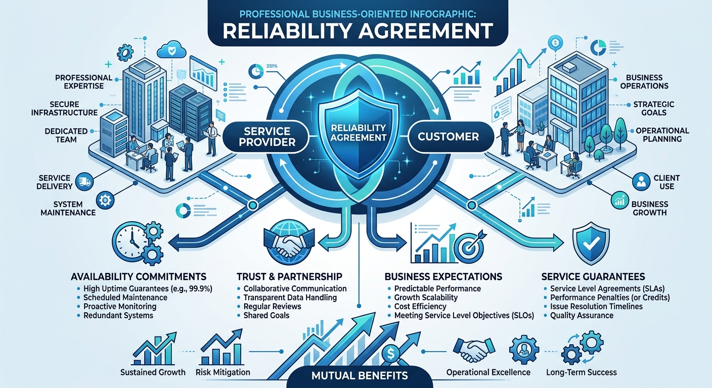
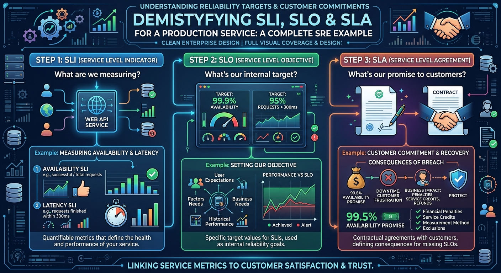

# SLI, SLO & SLA


# Introduction

Imagine you are responsible for a critical production service.

One morning, the Product Owner asks:

> "Is the platform reliable?"

A few minutes later, a customer asks:

> "What level of availability can we expect?"

Then leadership asks:

> "How do we know whether reliability is improving or getting worse?"

These questions sound simple.

But answering them accurately is surprisingly difficult.

For many years, teams used vague statements such as:

- We want high availability.
- We want fewer outages.
- We want better performance.
- We want a stable platform.

The problem is that none of these statements are measurable.

How reliable is "reliable"?

How fast is "fast"?

How available is "available"?

This is where three of the most important concepts in Site Reliability Engineering come into play:

- SLI (Service Level Indicator)
- SLO (Service Level Objective)
- SLA (Service Level Agreement)

Together, they help organizations transform reliability from an opinion into a measurable engineering discipline.

---

# Why Do We Need SLI, SLO and SLA?



Imagine a critical service processes incoming requests.

Engineers say:

```text
The service seems healthy.
```

Customers say:

```text
The service feels slow.
```

Leadership says:

```text
We experienced too many incidents this quarter.
```

Who is correct?

Without measurements, everyone may have a different opinion.

Reliability Engineering prefers facts over assumptions.

Instead of saying:

```text
The service is reliable.
```

We should be able to say:

```text
99.95% of requests completed successfully.

95% of requests completed within 500 milliseconds.
```

Now reliability becomes measurable.

---

# Understanding the Relationship



A simple way to remember the relationship is:

```text
SLI
 ↓
What are we measuring?

SLO
 ↓
What target do we want to achieve?

SLA
 ↓
What have we promised externally?
```

Think of it this way:

```text
Measurement
     ↓
Target
     ↓
Commitment
```

Or:

```text
SLI = Reality

SLO = Goal

SLA = Promise
```

---

# What is an SLI?

## Service Level Indicator

An SLI is a measurement.

It tells us how a service is performing.

An SLI answers questions such as:

- How many requests succeeded?
- How long did requests take?
- How often is the service available?
- How many transactions failed?

Simply put:

> An SLI is a metric that represents the health of a service.

---

## Example 1: Success Rate

Imagine a service processed:

```text
100,000 requests
```

Successful requests:

```text
99,950
```

Failed requests:

```text
50
```

Success Rate SLI:

```text
99,950 / 100,000

= 99.95%
```

---

## Example 2: Latency

Suppose:

```text
95% of requests complete within 300ms
```

Latency can also be an SLI.

---

## Common SLIs

### Availability

```text
Successful Requests %
```

### Latency

```text
Response Time
```

### Quality

```text
Processing Accuracy
```

### Throughput

```text
Transactions Per Second
```

### Reliability

```text
Success Rate
```

---

# A Real-World Example

Imagine a platform that processes incoming service events.

Useful SLIs might include:

```text
Request Success Rate

Average Processing Time

Processing Latency

Failed Event Percentage

Queue Processing Delay
```

Notice that these measurements focus on customer experience.

An SRE cares more about:

```text
Can users successfully use the service?
```

than:

```text
How many servers exist?
```

---

# What is an SLO?



## Service Level Objective

An SLO is a target.

Once we know what we are measuring, we need to decide:

> How good is good enough?

This becomes the Service Level Objective.

---

## Example

Suppose our SLI measures:

```text
Request Success Rate
```

Current performance:

```text
99.95%
```

Management decides:

```text
Target = 99.9%
```

This target becomes the SLO.

---

## Another Example

SLI:

```text
Response Time
```

SLO:

```text
95% of requests must complete within 500ms.
```

---

# Why SLOs Matter

Without SLOs, teams often chase perfection.

But perfection is expensive.

Imagine two services:

### Service A

```text
99.9% availability
```

### Service B

```text
99.9999% availability
```

The second service is significantly harder and more expensive to operate.

SLOs help organizations define:

> What level of reliability delivers sufficient business value?

The target should be ambitious but realistic.

---

# The Danger of Bad SLOs

A common mistake is setting SLOs too high.

Example:

```text
100% availability
```

At first, this sounds desirable.

However:

- No system is perfect.
- Failures are inevitable.
- Maintenance is required.
- Dependencies can fail.

An unrealistic SLO often creates frustration rather than improvement.

Good SLOs align with:

- Business requirements
- Customer expectations
- Technical reality

---

# What is an SLA?



## Service Level Agreement

An SLA is an external commitment.

It is usually a contractual or business promise.

An SLA tells customers:

> This is the level of service we guarantee.

Unlike SLOs, which are often internal targets, SLAs may have:

- Financial implications
- Penalties
- Service credits
- Legal commitments

---

## Example

Customer Agreement:

```text
99.5% monthly availability
```

If availability drops below:

```text
99.5%
```

Customers may receive:

- Refunds
- Credits
- Compensation

This is why organizations usually set:

```text
SLO > SLA
```

---

# Why SLOs Are Usually Higher Than SLAs

Example:

```text
Internal SLO

99.9%
```

```text
Customer SLA

99.5%
```

This creates a safety margin.

Even if the team misses the SLO occasionally:

```text
Customers are still protected.
```

This buffer helps reduce risk.

---

# Putting It All Together



Imagine a production service.

### Step 1

Measure performance.

```text
SLI

Request Success Rate
```

---

### Step 2

Define target.

```text
SLO

99.9%
```

---

### Step 3

Define commitment.

```text
SLA

99.5%
```

---

Relationship:

```text
SLI
  ↓
Measurement

SLO
  ↓
Engineering Target

SLA
  ↓
Business Promise
```

---

# Common Mistakes

## Measuring Everything

Having hundreds of SLIs creates noise.

Focus on metrics that matter to users.

---

## Choosing Infrastructure Metrics Only

Example:

```text
CPU Utilization
```

This may be useful operationally.

However, customers do not care about CPU.

Customers care about:

```text
Can I use the service successfully?
```

---

## Unrealistic SLOs

Example:

```text
100% availability
```

Usually leads to disappointment.

---

## Confusing SLO and SLA

Many engineers use these terms interchangeably.

Remember:

```text
SLO = Internal Goal

SLA = External Commitment
```

---

# How SLI, SLO and SLA Enable Better Engineering

Before SRE:

```text
System feels slow.
```

After SRE:

```text
95th percentile latency increased from 250ms to 900ms.
```

Before SRE:

```text
Availability seems poor.
```

After SRE:

```text
Availability dropped from 99.95% to 99.3%.
```

Opinions become measurements.

Measurements drive improvement.

---

# Looking Ahead

Once organizations define SLOs, another interesting question appears:

> What happens when we fail to meet our SLO?

This question led to one of the most powerful ideas in SRE:

# Error Budgets

In the next chapter, we'll learn how Error Budgets help teams balance innovation and reliability.

---

# Key Takeaways

✅ SLI is a measurement.

✅ SLO is a reliability target.

✅ SLA is a business commitment.

✅ Reliability must be measurable.

✅ Good SLIs focus on customer experience.

✅ SLOs should be ambitious but realistic.

✅ SLAs are often contractual commitments.

✅ Organizations typically set SLOs higher than SLAs.

✅ SLI + SLO + SLA transform reliability from opinion into engineering.

---

> "If reliability cannot be measured, it cannot be improved."