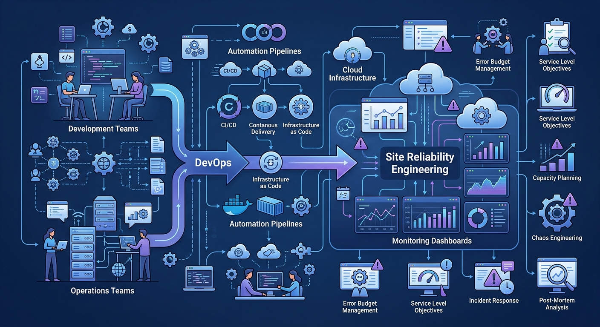
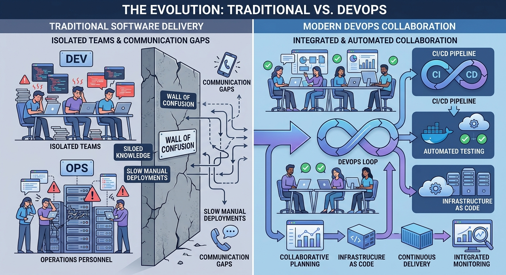
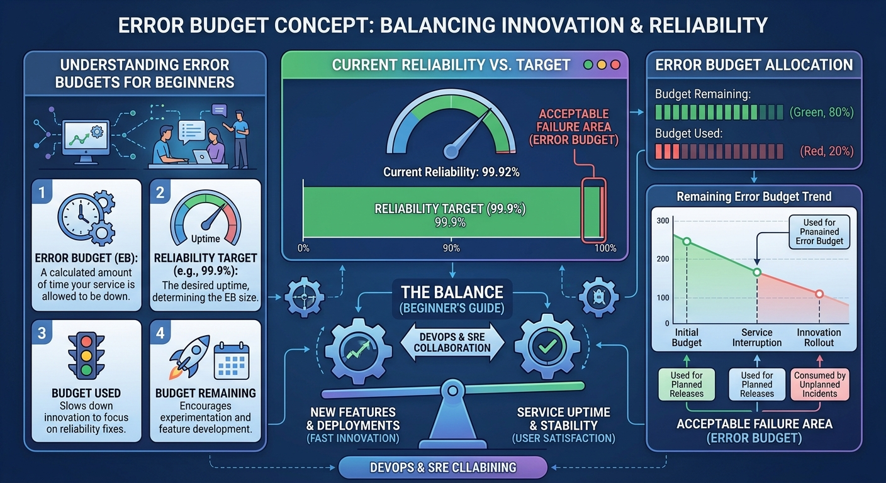
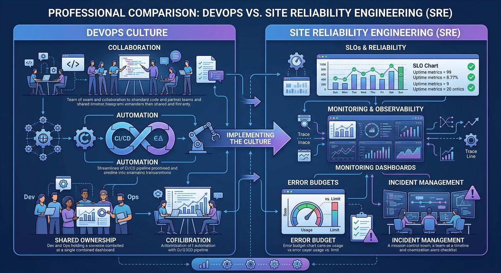
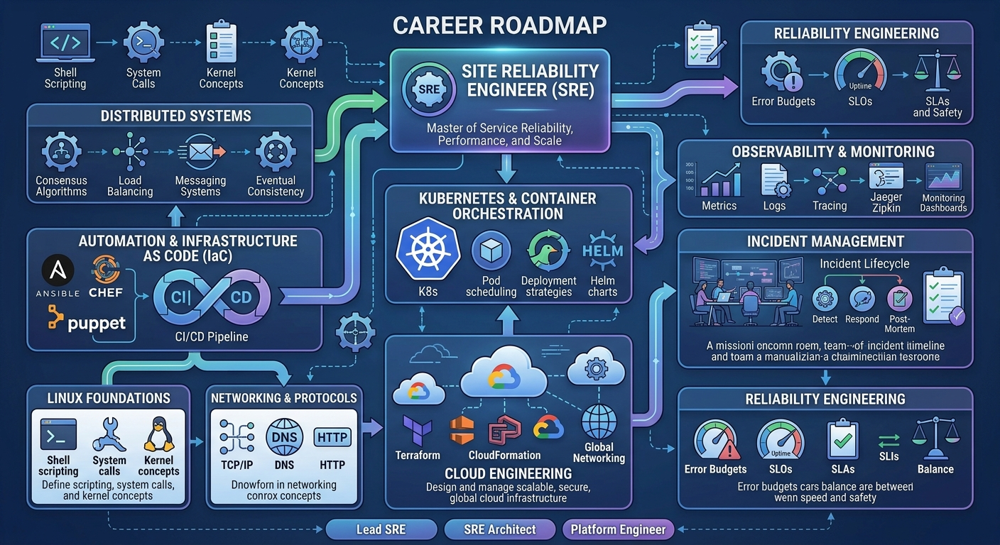

# SRE vs DevOps



# Introduction

One of the most common questions in modern technology organizations is:

> "If DevOps already exists, why do we need SRE?"

The short answer is:

> DevOps tells us **what we should achieve**.
>
> SRE provides a practical framework for **how to achieve it at scale**.

To understand the relationship between DevOps and SRE, we first need to understand the problem both were trying to solve.

---

# The World Before DevOps

In traditional organizations, Development and Operations often worked as separate teams.

```text
Developers
    ↓
Build software

Operations
    ↓
Run software
```

Developers focused on:

- New features
- Faster releases
- Innovation

Operations focused on:

- Stability
- Availability
- Change control

This created a natural conflict.

Developers wanted more changes.

Operations wanted fewer changes.

When things went wrong, blame often followed.

```text
Development:
"It works on my machine."

Operations:
"The deployment broke production."
```

The result was:

- Slow delivery
- Long release cycles
- Frustrated teams
- Frequent outages
- Poor collaboration

Something had to change.

---

# The Birth of DevOps



DevOps emerged as a response to this problem.

The idea was simple but powerful:

> Break down the barriers between Development and Operations.

Instead of working in isolation, teams should collaborate throughout the software lifecycle.

DevOps introduced principles such as:

- Shared ownership
- Collaboration
- Automation
- Continuous Integration
- Continuous Delivery
- Infrastructure as Code
- Faster feedback loops

The goal was to help organizations deliver software faster and more reliably.

For many organizations, DevOps was transformational.

Deployment frequency increased dramatically.

Automation reduced manual effort.

Teams became more aligned.

Software delivery became faster than ever before.

---

# Did DevOps Solve Everything?

Not quite.

As organizations adopted DevOps, a new challenge appeared.

While teams became very good at delivering software quickly, they often struggled to answer a critical question:

> How reliable should the system be?

Consider two teams:

### Team A

Releases once every three months.

System is very stable.

Innovation is slow.

### Team B

Releases fifty times per day.

Customers experience frequent outages.

Innovation is fast.

Neither approach is ideal.

The real challenge is finding the right balance between:

```text
Innovation
      AND
Reliability
```

DevOps encouraged collaboration and automation, but organizations still needed a way to measure and manage reliability objectively.

This is where SRE entered the picture.

---

# The Missing Piece

Imagine a product team says:

> "We want to move faster."

A reliability team says:

> "We need fewer outages."

Who is right?

The answer is:

**Both.**

The problem is that neither statement is measurable.

Without measurable goals, discussions become opinions.

SRE introduced a new way of thinking.

Instead of debating reliability, reliability could now be measured and managed.

---

# How SRE Extended the DevOps Journey

SRE did not replace DevOps.

SRE built upon many DevOps principles.

Think of it this way:

```text
DevOps
   ↓
Culture

SRE
   ↓
Implementation
```

Or even simpler:

```text
DevOps = Philosophy

SRE = Engineering Practice
```

DevOps tells organizations:

> Development and Operations should work together.

SRE asks:

> What reliability target are we trying to achieve?

DevOps encourages automation.

SRE measures whether that automation improves reliability.

DevOps promotes fast delivery.

SRE ensures fast delivery does not compromise customer experience.

---

# The Biggest Contribution of SRE

The most important contribution of SRE is that it made reliability measurable.

Before SRE, teams often used vague statements such as:

```text
We want better uptime.

We want fewer outages.

We want a stable platform.
```

SRE introduced concepts such as:

- Service Level Indicators (SLIs)
- Service Level Objectives (SLOs)
- Error Budgets

Now reliability could be expressed in numbers.

Instead of saying:

```text
We want a reliable service.
```

Teams could say:

```text
99.95% of requests should succeed.

95% of requests should complete within 500ms.
```

This changed everything.

---

# The Error Budget Revolution



One of the most innovative concepts in SRE is the Error Budget.

The idea is surprisingly simple.

Perfect reliability does not exist.

Failures will happen.

Instead of demanding 100% availability, teams agree on an acceptable level of failure.

For example:

```text
SLO = 99.9%

Allowed Failure = 0.1%
```

This 0.1% becomes the Error Budget.

As long as the service stays within its budget:

- Teams can innovate
- Teams can release faster
- Teams can experiment

If the budget is exhausted:

- Reliability improvements become the priority

This creates a healthy balance between innovation and stability.

Without endless arguments.

Without relying on opinions.

With data.

---

# A Real-World Example

Imagine an OTA platform responsible for distributing software updates.

Development teams want to:

- Introduce new features
- Support new vehicle capabilities
- Release updates more frequently

Operations teams want to:

- Avoid failed campaigns
- Prevent platform outages
- Ensure update success

DevOps encourages both teams to collaborate.

SRE introduces measurable objectives.

For example:

```text
OTA Campaign Success Rate

Target:
99.9%
```

```text
Vehicle Update Delivery Latency

Target:
95% completed within 30 minutes
```

```text
Platform Availability

Target:
99.95%
```

Now everyone shares the same goals.

Reliability becomes measurable.

Trade-offs become visible.

Decision-making becomes easier.

---

# DevOps and SRE Are Better Together



One of the biggest misconceptions is:

> SRE will replace DevOps.

This is incorrect.

In reality:

```text
DevOps + SRE
      =
High Performing Engineering Organization
```

DevOps provides:

- Culture
- Collaboration
- Automation mindset
- Faster delivery

SRE provides:

- Reliability engineering
- Observability
- Service level management
- Error budgets
- Capacity planning
- Incident management

They are complementary, not competing.

---

# DevOps vs SRE

| DevOps | SRE |
|----------|----------|
| Primarily a culture | Primarily an engineering discipline |
| Focuses on collaboration | Focuses on reliability |
| Encourages automation | Measures automation effectiveness |
| Promotes faster delivery | Balances delivery with reliability |
| Removes silos | Defines reliability goals |
| Shared ownership | Reliability ownership |
| Philosophy | Practical implementation |

A useful way to think about it is:

> DevOps improves how teams work together.
>
> SRE improves how systems behave in production.

---

# Why SRE Has Become So Important

Modern systems are becoming increasingly complex.

Organizations now operate:

- Cloud-native platforms
- Microservices
- Kubernetes clusters
- Event-driven architectures
- Large-scale distributed systems

A system may consist of hundreds of services.

Each service may have dozens of dependencies.

Failures are no longer isolated.

They can cascade across the entire platform.

Modern organizations need engineers who can:

- Understand complexity
- Measure reliability
- Design resilient systems
- Build observability
- Automate recovery
- Continuously improve operations

This is exactly where SRE thrives.

---

# Why Consider a Career in SRE?



SRE combines multiple engineering disciplines:

```text
Software Engineering
        +
Cloud Engineering
        +
Infrastructure
        +
Automation
        +
Observability
        +
Architecture
        +
Problem Solving
```

Few roles provide this breadth of exposure.

An SRE develops expertise in:

- Distributed Systems
- Cloud Platforms
- Kubernetes
- Linux
- Networking
- Monitoring
- Automation
- Reliability Engineering

Most importantly, SREs work on some of the most challenging problems in technology:

> Keeping critical systems running when failure is inevitable.

---

# Key Takeaways

✅ DevOps emerged to improve collaboration between Development and Operations.

✅ DevOps is primarily a culture and way of working.

✅ DevOps significantly improved software delivery speed and automation.

✅ DevOps alone does not define what "reliable enough" means.

✅ SRE extends DevOps by making reliability measurable.

✅ SRE introduces SLIs, SLOs, and Error Budgets.

✅ SRE helps organizations balance innovation with stability.

✅ DevOps and SRE complement each other rather than compete.

✅ DevOps improves team behavior; SRE improves system reliability.

---

> "DevOps asks us to work together. SRE helps us decide what success looks like and how to measure it."