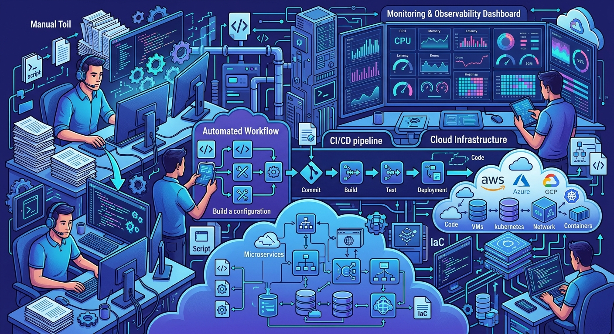
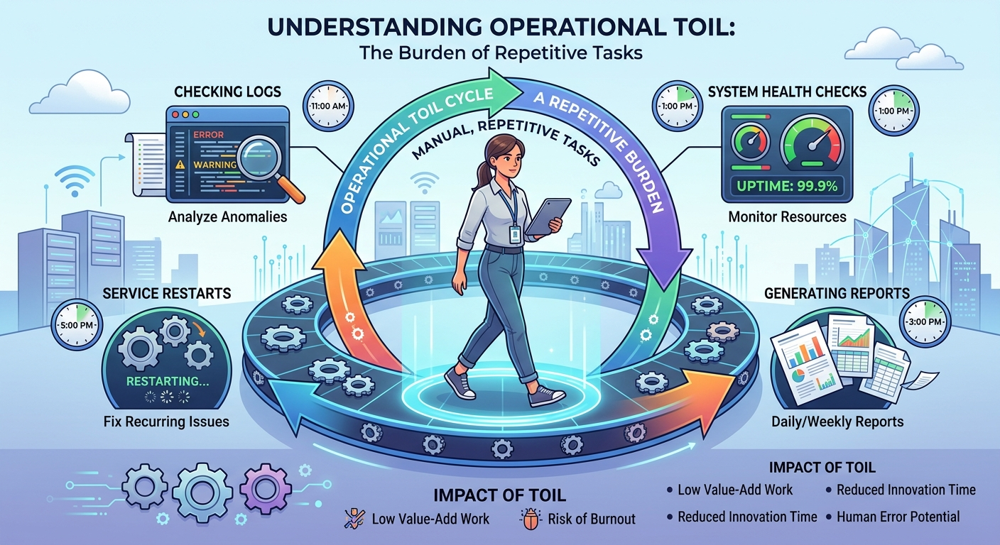
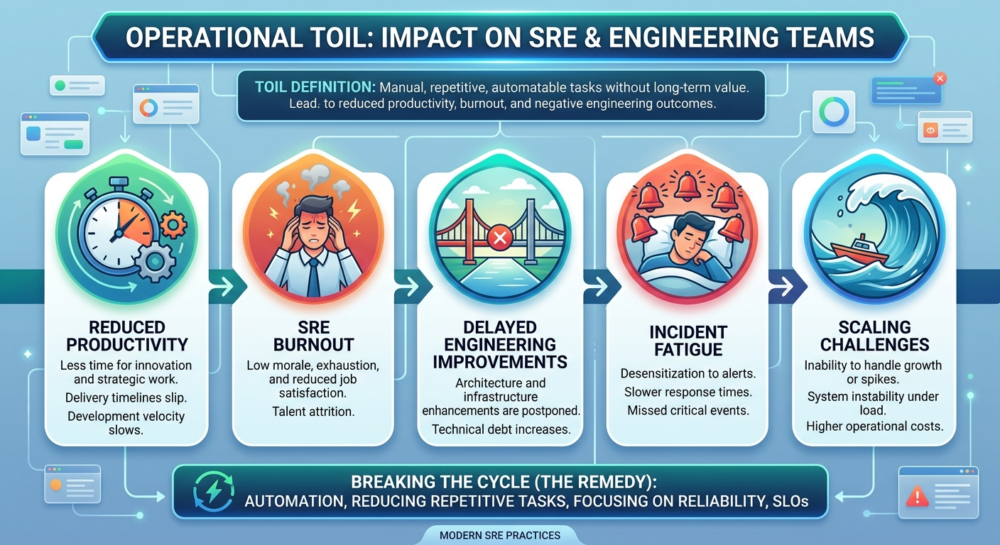
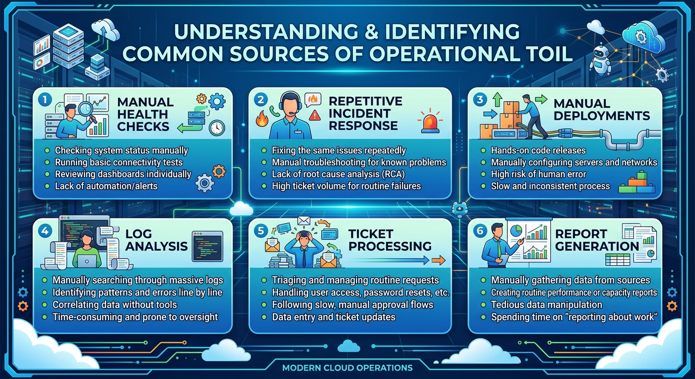
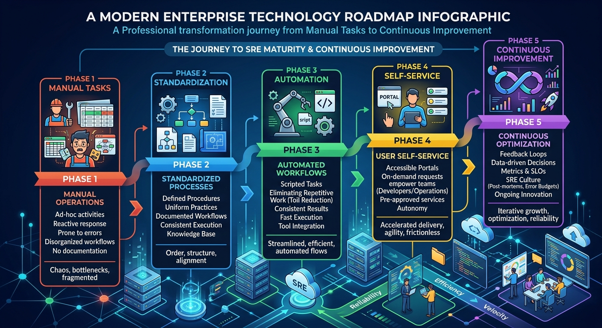
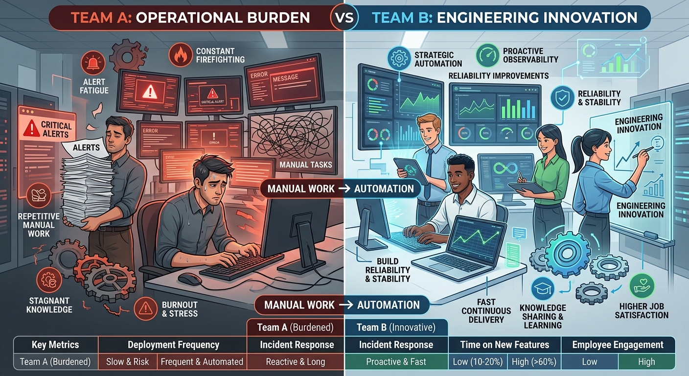

# Toil Reduction



# Introduction

Imagine you are an engineer responsible for a production platform.

Every morning starts the same way.

You:

- Check service health
- Review logs
- Verify dashboards
- Restart failed services
- Generate status reports
- Respond to routine alerts

The next day?

You do it all again.

And again.

And again.

At first, this work feels useful.

After all, the platform is running.

But eventually a question arises:

> Why are highly skilled engineers spending so much time doing repetitive work?

This question played a major role in the creation of Site Reliability Engineering.

One of Google's most important observations was:

> Engineers should spend their time engineering solutions, not repeatedly performing the same operational tasks.

This repetitive operational work became known as:

# Toil

Reducing toil is one of the foundational goals of SRE.

---

# What Is Toil?



Google's SRE books define toil as operational work that tends to be:

- Manual
- Repetitive
- Automatable
- Tactical
- Lacking long-term value
- Growing linearly as the system grows

A simple way to think about it:

> If you have to do the same task repeatedly and a computer could do it instead, it is probably toil.

---

# Examples of Toil

Consider the following activities.

### Example 1

Every morning:

```text
Log in to 20 servers.

Check disk usage.

Record results in a spreadsheet.
```

---

### Example 2

Every week:

```text
Generate the same health report.

Email it to stakeholders.
```

---

### Example 3

Whenever a service fails:

```text
Run the same commands.

Collect the same logs.

Execute the same restart procedure.
```

---

### Example 4

Several times per day:

```text
Manually verify whether jobs completed successfully.
```

All of these activities consume valuable engineering time.

Most importantly:

```text
They add little long-term value.
```

---

# Not All Operational Work Is Toil

One of the biggest misconceptions is:

> "All operational work is toil."

This is not true.

Some operational work is incredibly valuable.

For example:

### Designing a Monitoring Strategy

```text
Valuable Engineering Work
```

---

### Performing Capacity Planning

```text
Valuable Engineering Work
```

---

### Improving Reliability

```text
Valuable Engineering Work
```

---

### Automating Incident Response

```text
Valuable Engineering Work
```

---

The difference is simple:

Toil keeps the lights on today.

Engineering improvements make tomorrow better.

---

# Why Toil Is Dangerous



At first glance, toil may seem harmless.

Unfortunately, excessive toil creates several problems.

---

## Reduced Productivity

If engineers spend most of their time on repetitive work:

```text
Less time remains for innovation.
```

---

## Reduced Reliability

When engineers are constantly busy reacting:

```text
They have less time to prevent future incidents.
```

---

## Increased Burnout

Repeating the same tasks every day becomes draining.

Engineers often feel:

- Frustrated
- Demotivated
- Overwhelmed

---

## Scaling Problems

Imagine:

```text
100 services
```

requires:

```text
1 engineer
```

for manual operations.

What happens when there are:

```text
1,000 services?
```

Hiring more people is not a sustainable solution.

Automation scales far better than headcount.

---

# The SRE View of Toil

One of the biggest mindset shifts in SRE is:

> If a task must be performed repeatedly, automate it.

Traditional operations often solved problems like this:

```text
More work
      ↓
More people
```

SRE prefers:

```text
More work
      ↓
More automation
```

The goal is not to eliminate humans.

The goal is to allow humans to focus on higher-value work.

---

# A Simple Story

Imagine an engineer who spends:

```text
30 minutes
```

each day checking service status.

Over a year:

```text
30 × 365

=

10,950 minutes
```

Or approximately:

```text
182 hours
```

Or:

```text
More than 22 working days
```

That is nearly an entire month spent performing a task that could potentially be automated.

This is exactly the type of inefficiency SRE seeks to eliminate.

---

# Common Sources of Toil



Many organizations encounter toil in similar areas.

---

## Manual Health Checks

```text
Checking service health manually.
```

---

## Manual Deployments

```text
Executing deployment steps by hand.
```

---

## Repetitive Incident Response

```text
Running the same diagnostic actions repeatedly.
```

---

## Manual Log Analysis

```text
Searching logs manually for known issues.
```

---

## Manual Report Generation

```text
Preparing the same reports every week.
```

---

## Ticket Processing

```text
Repeatedly handling identical support requests.
```

---

# How SRE Reduces Toil



Toil reduction typically follows a simple journey:

```text
Manual Tasks
       ↓
Standardization
       ↓
Automation
       ↓
Self-Service
       ↓
Continuous Improvement
```

---

## Step 1: Identify Repetition

Ask:

```text
What tasks are performed repeatedly?
```

Patterns often emerge quickly.

---

## Step 2: Standardize

Before automating a process, it should be consistent.

Good automation requires well-defined procedures.

---

## Step 3: Automate

Examples include:

- Monitoring
- Health Checks
- Deployments
- Reporting
- Alert Triage
- Data Collection

---

## Step 4: Improve Continuously

Automation itself should evolve.

What works today may require improvement tomorrow.

---

# Real-World Examples of Toil Reduction

## Example: Monitoring

### Before

```text
Engineer checks application status manually.
```

### After

```text
Monitoring platform performs checks automatically.

Alerts generated only when required.
```

---

## Example: Deployment

### Before

```text
Engineer performs deployment steps manually.
```

### After

```text
CI/CD pipeline executes deployment automatically.
```

---

## Example: Reporting

### Before

```text
Engineer prepares weekly performance reports.
```

### After

```text
Dashboard updates automatically in real time.
```

---

# The Relationship Between Toil and Reliability

Many people assume toil reduction is only about saving time.

The reality is much bigger.

Reducing toil often improves reliability.

Why?

Because humans make mistakes.

Consider:

### Manual Process

```text
Run 20 commands.
```

Every execution introduces risk.

---

### Automated Process

```text
Run tested automation.
```

The process becomes:

- Faster
- Consistent
- Repeatable
- Less error-prone

In many cases:

> Reduced toil leads directly to improved reliability.

---

# Warning: Don't Automate Chaos

Automation is powerful.

However, automating a broken process simply creates faster problems.

Before automating:

Ask:

```text
Is the process understood?

Is it documented?

Is it repeatable?

Is it worth automating?
```

Good automation starts with good process design.

---

# Characteristics of Healthy SRE Teams



Healthy SRE teams generally spend:

```text
Less time

on repetitive operations
```

and

```text
More time

on engineering improvements
```

Examples include:

- Building automation
- Improving observability
- Enhancing reliability
- Strengthening resilience
- Creating self-healing systems
- Improving deployment processes

---

# Why Toil Reduction Matters

Without toil reduction:

```text
Growth
      ↓
More Manual Work
      ↓
More Engineers Needed
```

With toil reduction:

```text
Growth
      ↓
More Automation
      ↓
Better Scalability
```

This is one of the reasons companies operating large-scale platforms invest heavily in automation.

Automation allows systems to grow without requiring operational effort to grow at the same pace.

---

# Looking Ahead

Reducing toil helps teams spend less time reacting.

But after reducing manual work, another important question appears:

> What should we be monitoring?

This brings us to one of the most famous concepts in SRE:

# The Four Golden Signals

The Golden Signals help engineers understand the health of a system and detect problems before users are significantly impacted.

---

# Key Takeaways

✅ Toil is repetitive operational work that adds limited long-term value.

✅ Not all operational work is toil.

✅ Excessive toil reduces productivity and innovation.

✅ Excessive toil can contribute to burnout.

✅ Automation is one of the primary ways to reduce toil.

✅ Good automation improves both efficiency and reliability.

✅ Healthy SRE teams focus on engineering improvements rather than repetitive tasks.

✅ Toil reduction enables organizations to scale more effectively.

✅ One of the core missions of SRE is to automate repetitive operational work.

---

> "Every repetitive task is an opportunity for automation. Every automation is an opportunity to improve reliability."