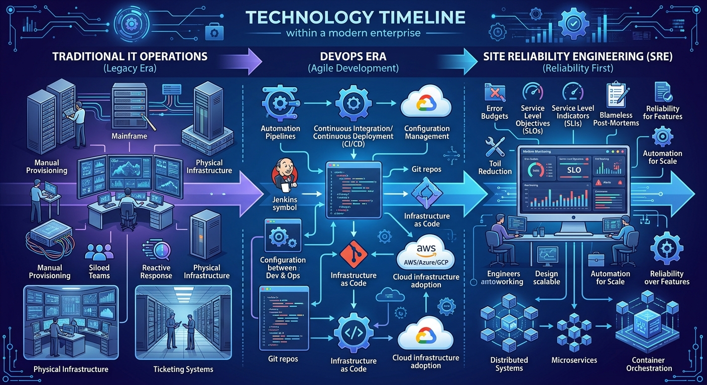
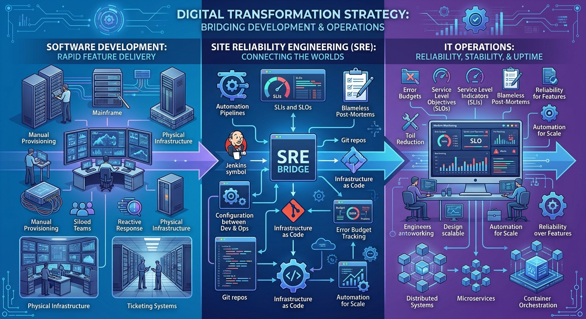
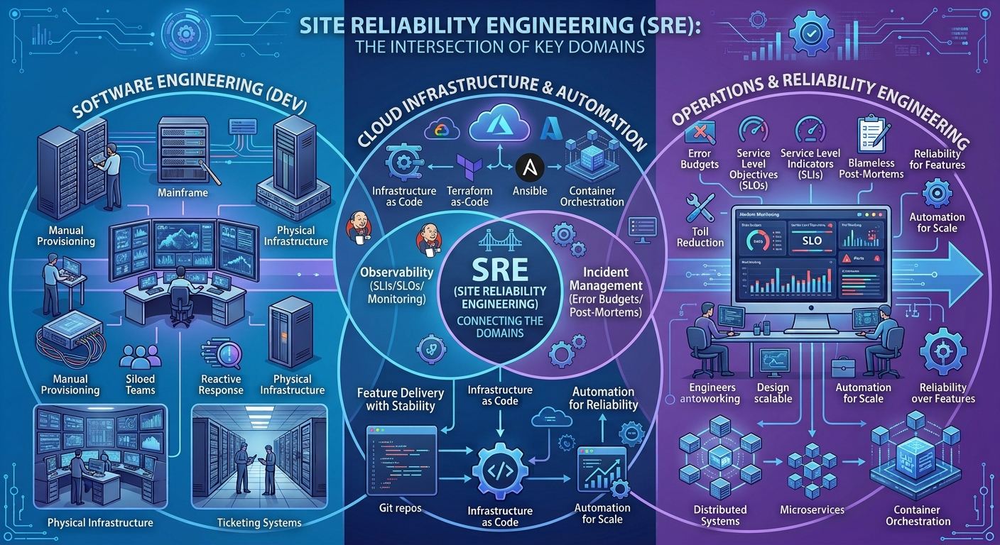
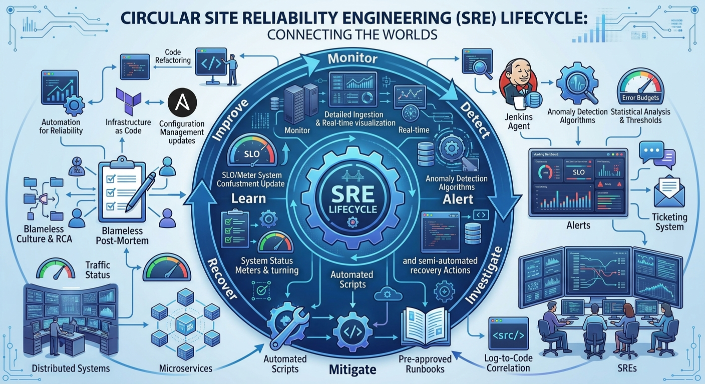

# What is Site Reliability Engineering (SRE)?



## Imagine This...

It is 2:00 AM.

A critical service suddenly becomes unavailable.

Customers can no longer access the features they rely on every day.

Support teams are flooded with tickets.

A war room is opened.

Leadership wants answers.

Everyone asks the same question:

> What happened?

A few minutes later, another question appears.

> Why didn't we know this was going to happen?

And finally, the most important question:

> How do we stop this from happening again?

The answer to that question led to the birth of **Site Reliability Engineering (SRE).**

---

# The Early Days of Software Operations

In the early days of software, systems were relatively simple.

A typical application might consist of:

- One application server
- One database
- A handful of users
- A small operations team

When something broke, engineers logged in to a server and fixed it manually.

As the internet grew, things became more complicated.

Applications turned into distributed systems.

Users increased from thousands to millions.

Deployments became more frequent.

Infrastructure grew from a few servers to entire data centers.

Traditional operations models started to show their limits.

Organizations needed a new way to operate software at scale.

---

# A Problem Nobody Could Ignore

As systems became larger, a natural conflict emerged.

Development teams wanted to deliver features quickly.

Operations teams wanted to keep systems stable.

Every deployment introduced risk.

Every outage affected customers.

Businesses wanted both:

- Faster innovation
- Better reliability

At first, this seemed impossible.

How could organizations move faster while also reducing outages?

---

# Google's Revolutionary Idea

In the early 2000s, Google faced this exact challenge.

Its services were growing rapidly and were being used by millions of people around the world.

Google realized something important:

> Hiring more operators would not solve the problem.

Instead of scaling people, they decided to scale engineering.

They started applying software engineering principles to operational problems.

Whenever engineers encountered repetitive manual work, they automated it.

Whenever they experienced failures, they measured them.

Whenever systems became difficult to operate, they built tools to simplify them.

This approach eventually became known as:

# Site Reliability Engineering

---

# What Exactly Is SRE?



The simplest definition of SRE is:

> Site Reliability Engineering is the practice of using software engineering, automation, and operational excellence to build and operate reliable systems at scale.

An SRE is responsible for ensuring systems remain:

- Reliable
- Available
- Scalable
- Observable
- Resilient

while allowing development teams to continue delivering business value.

A simple analogy:

Developers build the vehicle.

SREs make sure the vehicle can reliably complete the journey.

---

# Why Reliability Matters

Imagine:

- A banking application that fails during transactions.
- A navigation system that is unavailable when users need directions.
- A software update platform that cannot reliably deliver updates.
- A connected device platform that loses visibility into its products.

No matter how impressive the features are, users eventually lose trust if the service is unreliable.

Reliability is not just a technical objective.

It is a business requirement.

---

# The Most Important Lesson

One of the first things every SRE learns is:

> Failure is inevitable.

Servers fail.

Networks fail.

Databases fail.

Configurations contain mistakes.

Cloud services experience outages.

Humans make errors.

The goal of SRE is not to eliminate failures completely.

That is impossible.

The goal is to:

- Detect failures quickly
- Understand failures quickly
- Recover quickly
- Learn from failures
- Improve systems continuously

---

# How SRE Changed the Industry

Before SRE:

```text
Problem occurs
      ↓
Customer notices
      ↓
Support raises ticket
      ↓
Engineers investigate
      ↓
Issue fixed
```

Modern SRE practices aim for:

```text
Problem occurs
      ↓
Monitoring detects issue
      ↓
Alert generated
      ↓
Automated response
      ↓
Engineer investigates
      ↓
Root cause identified
      ↓
Permanent improvement implemented
```

Instead of constantly fighting fires, organizations began engineering reliability.

---

# What Problems Does SRE Solve?

Site Reliability Engineering helps organizations tackle challenges such as:

## Frequent Outages

Building systems that tolerate failures and recover gracefully.

## Lack of Visibility

Implementing monitoring, logging, and observability from day one.

## Alert Fatigue

Reducing noise so engineers focus only on actionable alerts.

## Slow Incident Response

Improving detection and reducing recovery time.

## Operational Toil

Automating repetitive manual tasks.

## Scaling Challenges

Ensuring systems continue to perform as demand grows.

---

# What Does an SRE Actually Do?

A common misconception is that SRE is simply production support.

In reality, SRE involves engineering.

A typical SRE may spend time:

- Defining reliability objectives
- Building monitoring and dashboards
- Improving observability
- Writing automation scripts
- Performing capacity planning
- Investigating incidents
- Developing runbooks
- Improving deployment reliability
- Building self-healing mechanisms
- Learning from outages

Great SREs spend more time preventing problems than reacting to them.

---

# Why Become an SRE?



SRE sits at the intersection of multiple engineering disciplines:

```text
Software Engineering
        +
Cloud Computing
        +
Infrastructure
        +
Automation
        +
Observability
        +
Architecture
        +
Problem Solving
```

Few roles provide such a broad view of modern technology systems.

As an SRE, you gain experience with:

- Distributed Systems
- Linux
- Networking
- Kubernetes
- Cloud Platforms
- Databases
- Monitoring
- Automation
- Reliability Engineering

Every day presents new challenges and learning opportunities.

If you enjoy problem-solving and understanding how complex systems work, SRE can be one of the most rewarding careers in technology.

---

# The Reliability Lifecycle



Reliability is not a one-time activity.

It is a continuous cycle:

```text
Monitor
   ↓
Detect
   ↓
Alert
   ↓
Investigate
   ↓
Mitigate
   ↓
Recover
   ↓
Learn
   ↓
Improve
```

This cycle repeats throughout the life of every production system.

---

# Looking Ahead

Modern systems are becoming increasingly complex.

Cloud computing, microservices, containers, connected devices, artificial intelligence, and distributed platforms are creating new reliability challenges every year.

As this complexity grows, Site Reliability Engineering becomes more important than ever.

Reliability cannot be added at the end.

It must be designed, measured, monitored, and continuously improved.

That is the mission of Site Reliability Engineering.

---

# Key Takeaways

✅ Reliability is a business requirement.

✅ SRE was created to operate large-scale systems reliably.

✅ SRE applies engineering principles to operational challenges.

✅ Failure is inevitable; resilience is engineered.

✅ Automation is preferred over repetitive manual work.

✅ Great systems are designed to detect, recover, and learn from failures.

✅ SRE enables organizations to innovate without sacrificing stability.

---

> "Hope is not a strategy. Reliability is engineered."