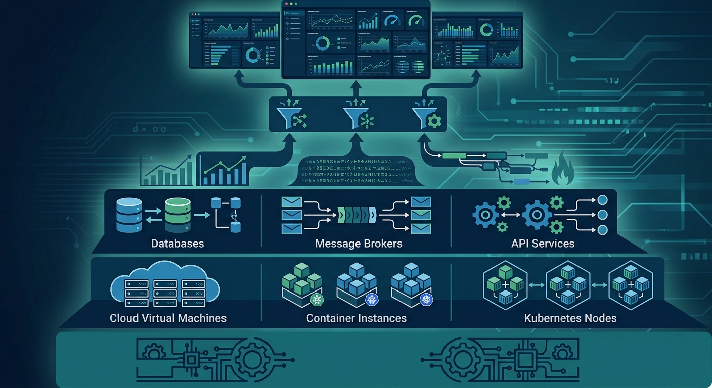
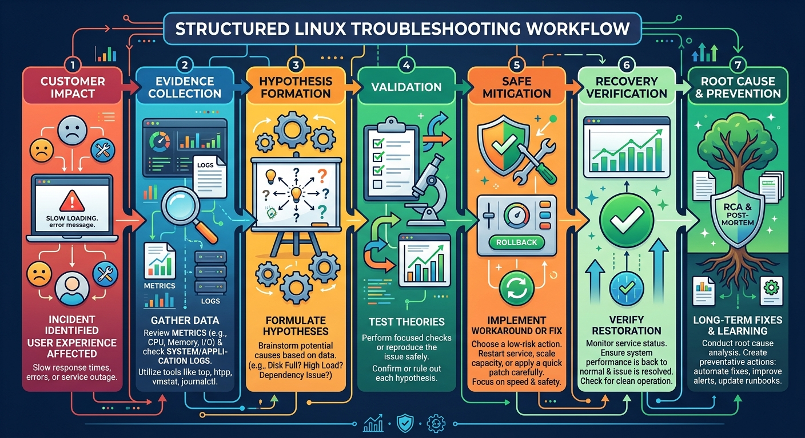
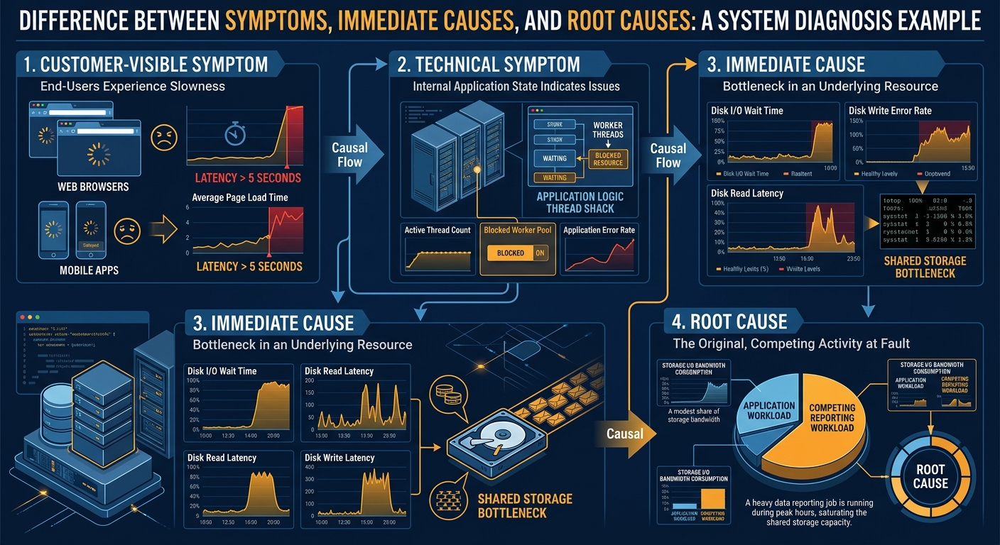
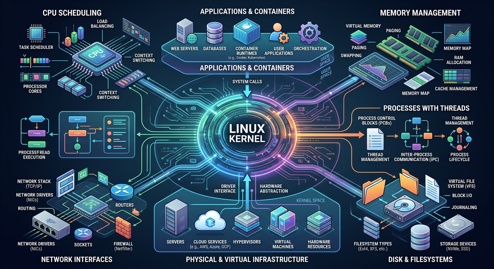
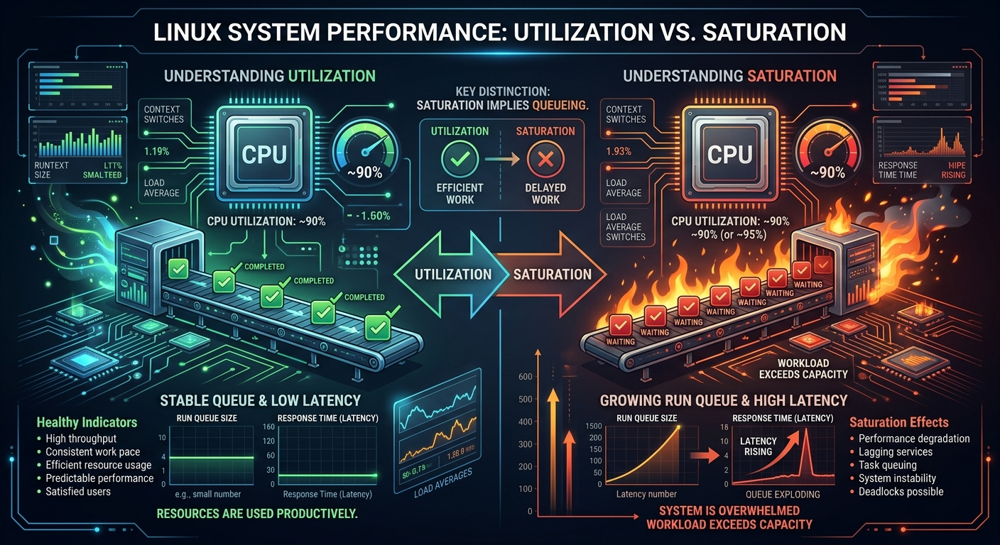
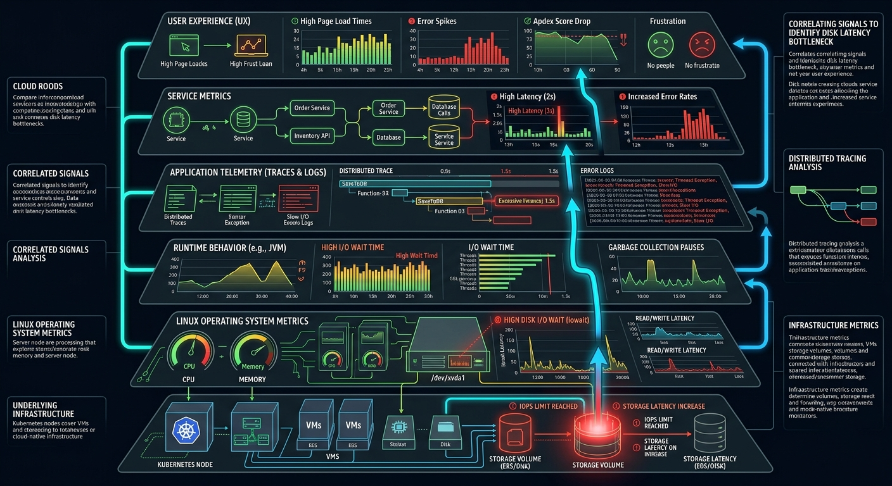
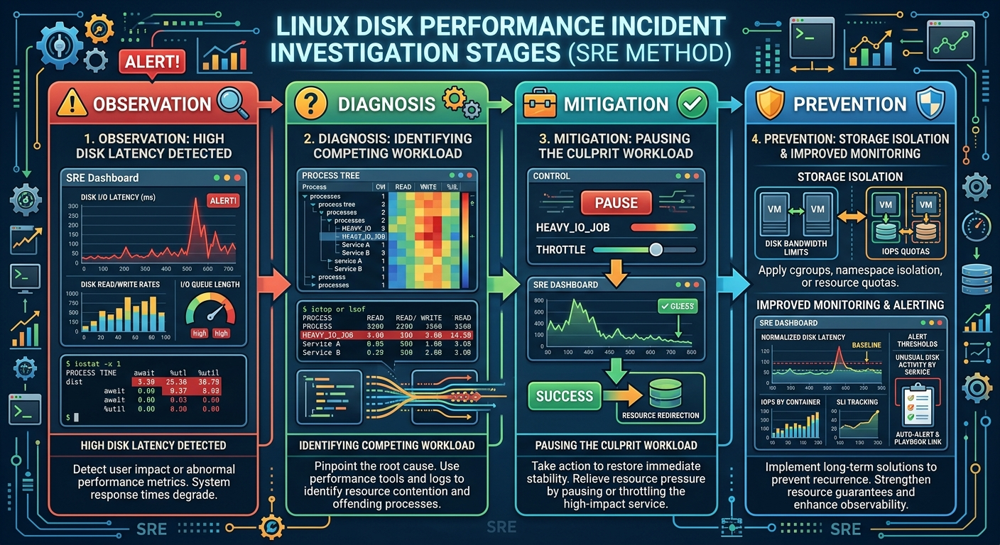

# Linux for Site Reliability Engineers



## Introduction

A production event-processing platform has started falling behind.

Incoming events continue to arrive, but the processing backlog is growing.

The application dashboard shows increasing latency.

The service is running.

No critical application error is visible.

The database appears healthy.

The engineering team initially suspects that the application needs more instances.

Before increasing capacity, an SRE examines the Linux host and discovers something unexpected:

```text
CPU utilization is normal.

Memory utilization is normal.

The application process is running.

Disk I/O latency is extremely high.
```

A reporting workload running on the same host is performing large synchronous writes.

The application was not short of compute capacity.

It was waiting for storage.

Adding more application instances would not have solved the problem. It might have made the situation worse by creating even more disk activity.

This example captures why Linux knowledge matters to an SRE.

Linux helps us look beneath the application and understand what the system is actually doing.

---

# Why Linux Matters to an SRE

Linux is one of the foundations of modern infrastructure.

It runs:

- Virtual machines
- Cloud workloads
- Container hosts
- Kubernetes nodes
- Databases
- Message brokers
- Web servers
- API platforms
- Build agents
- Observability collectors
- Edge systems

Even when an engineer does not interact directly with a Linux server, the application may still depend on the Linux kernel.

A container may look isolated, but it shares the host operating system's kernel.

A Kubernetes pod may look like an independent environment, but its CPU scheduling, memory management, networking, storage access, and process execution ultimately depend on Linux capabilities provided by the underlying node.

Understanding Linux helps an SRE connect application symptoms with system behavior.

---

# Linux Is More Than a Collection of Commands

Many Linux guides begin with a long list of commands:

```bash
top
free
df
ps
grep
netstat
```

These commands can be useful.

However, memorizing commands does not automatically create troubleshooting capability.

A command is valuable only when we understand:

1. What question it answers
2. What data it reads
3. How to interpret its output
4. What limitations it has
5. What evidence should be collected next

For example:

```bash
top
```

may show that CPU utilization is high.

It does not automatically explain:

- Why CPU utilization is high
- Whether customers are affected
- Whether the utilization is expected
- Whether one process or many processes are responsible
- Whether the system is experiencing CPU saturation
- Whether a container CPU limit is involved
- Whether the correct response is scaling, optimization, or no action

Linux troubleshooting is not about running every command you remember.

It is about asking better questions.

---

# The SRE Troubleshooting Mindset



An inexperienced troubleshooting approach often looks like this:

```text
Notice a symptom
      ↓
Run random commands
      ↓
Restart the service
      ↓
Wait to see what happens
```

The service may recover temporarily.

However, the evidence may disappear and the underlying problem may remain.

A structured SRE approach looks different:

```text
Confirm the impact
      ↓
Collect evidence
      ↓
Form a hypothesis
      ↓
Test the hypothesis
      ↓
Mitigate safely
      ↓
Verify recovery
      ↓
Identify the root cause
      ↓
Prevent recurrence
```

The objective is not simply to make the alert disappear.

The objective is to understand:

> What changed, which resource became constrained, how users were affected, and what will prevent the same failure from happening again?

---

# Start With Customer Impact

Before logging in to a host, first understand the impact.

Ask:

- Which service is affected?
- Which users or workloads are affected?
- When did the problem begin?
- Is the problem continuous or intermittent?
- Is the service unavailable, slow, or returning incorrect results?
- Did traffic change?
- Was there a deployment or configuration change?
- Is the issue limited to one host, one zone, or the entire service?

This prevents a common mistake:

```text
Finding an unusual Linux metric and assuming it is the cause.
```

A production host almost always contains something unusual.

Not every unusual observation is relevant to the incident.

Customer impact provides context.

---

# Symptoms, Causes, and Root Causes



A critical SRE skill is distinguishing between a symptom and a cause.

Consider this sequence:

```text
Application latency increases
      ↓
Requests begin to queue
      ↓
Worker threads remain blocked
      ↓
Disk operations are slow
      ↓
A new reporting workload is saturating the shared volume
```

In this example:

### Customer-visible symptom

```text
Application latency increased.
```

### Technical symptom

```text
Worker threads became blocked.
```

### Immediate cause

```text
Disk operations became slow.
```

### Root cause

```text
A new reporting workload saturated shared storage.
```

If the team responds only by restarting the application, it addresses neither the cause nor the root cause.

The application may become slow again as soon as the reporting workload resumes.

---

# How an Application Uses Linux

An application does not directly control physical hardware.

It requests services from the operating system.

For example:

```text
Application
      ↓
System Calls
      ↓
Linux Kernel
      ↓
CPU, Memory, Storage and Network
```

The Linux kernel manages:

- Process scheduling
- Memory allocation
- Filesystems
- Disk access
- Network communication
- Device access
- Resource isolation
- Security boundaries

When an application reads a file, opens a network connection, allocates memory, creates a thread, or writes data, the operating system is involved.

This is why an application-level problem may originate from a host-level limitation.

---

# The Core Linux Resources



Most Linux performance investigations eventually involve one or more of the following resources.

## CPU

The CPU executes application and kernel instructions.

Important questions include:

- Is the CPU busy?
- Is the CPU saturated?
- Is one core overloaded?
- Is the process waiting to be scheduled?
- Is the system spending excessive time in kernel operations?
- Is virtualization steal time affecting the host?
- Is a container CPU limit throttling the workload?

High CPU utilization is not automatically bad.

A batch-processing service may be designed to use all available CPU.

The important question is:

> Is CPU behavior preventing the service from meeting its reliability objective?

---

## Memory

Memory holds application data, executable code, filesystem cache, and kernel structures.

Important questions include:

- How much memory is available?
- Is memory consumption growing?
- Is the system swapping?
- Are major page faults increasing?
- Is the kernel reclaiming memory aggressively?
- Did the Out of Memory Killer terminate a process?
- Is the workload approaching a container memory limit?

A Linux system may intentionally use otherwise idle memory for filesystem cache.

For this reason, a low value in the `free` column alone does not prove memory pressure.

---

## Disk and Filesystems

Storage investigations involve more than checking whether a disk is full.

Important questions include:

- Is the filesystem running out of capacity?
- Are inodes exhausted?
- Is disk latency increasing?
- Is the workload limited by IOPS or throughput?
- Is a deleted file still being held open?
- Has the filesystem become read-only?
- Is one workload affecting another workload on shared storage?

A filesystem can have plenty of free space and still perform poorly.

Capacity and performance are separate concerns.

---

## Network

The network connects the service to users, dependencies, databases, and other services.

Important questions include:

- Is the interface up?
- Is name resolution working?
- Is the expected port listening?
- Is routing correct?
- Are packets being dropped?
- Are TCP retransmissions increasing?
- Is the remote service refusing connections?
- Are connections timing out?
- Are ephemeral ports or sockets exhausted?

A connection timeout and a connection refusal may look similar to a user, but they point toward different technical conditions.

---

## Processes and Threads

Applications run as processes, often containing multiple threads.

Important questions include:

- Is the expected process running?
- What state is it in?
- Is it consuming resources?
- Is it blocked?
- Is it repeatedly restarting?
- Has it created too many threads?
- Does it have too many open files?
- Is it waiting for storage or network activity?

A process appearing in a process list does not prove that the application is healthy.

The process may exist while making no useful progress.

---

# Utilization Is Not the Same as Saturation



These two concepts are frequently confused.

## Utilization

Utilization describes how busy a resource is.

Example:

```text
CPU utilization = 85%
```

## Saturation

Saturation describes how much work is waiting because the resource cannot serve it immediately.

Example:

```text
CPU run queue is growing.
```

A resource can have high utilization without harmful saturation.

Consider a worker that efficiently processes background events:

```text
CPU utilization: 90%

Queue stable

Latency within SLO

No work waiting for CPU
```

The high utilization may be expected.

Now consider:

```text
CPU utilization: 90%

Run queue growing

Processing latency increasing

SLO at risk
```

The second situation is much more concerning.

SREs therefore avoid making decisions from utilization alone.

---

# Linux and the Golden Signals

Linux metrics become more useful when connected to the Four Golden Signals.

## Latency

Linux may influence latency through:

- CPU scheduling delays
- Disk I/O delays
- Memory pressure
- Network retransmissions
- DNS delays

## Traffic

Linux can help reveal:

- Request volume
- Connection volume
- Packet rates
- Process workload
- Disk operations

## Errors

Linux may reveal:

- Failed system calls
- Connection failures
- Filesystem errors
- Process crashes
- Out of Memory events
- Permission failures

## Saturation

Linux may reveal:

- CPU run queues
- Memory pressure
- Swap activity
- Disk queue depth
- Socket limits
- Connection pool exhaustion

Host metrics should not be observed in isolation.

They should be correlated with service behavior and user impact.

---

# Host-Level and Application-Level Evidence



A strong investigation combines multiple layers of evidence.

```text
User Experience
      ↓
Service Metrics
      ↓
Application Metrics
      ↓
Runtime Metrics
      ↓
Operating System Metrics
      ↓
Infrastructure Metrics
```

For example:

```text
User reports slow processing
      ↓
Service latency is increasing
      ↓
Worker throughput is decreasing
      ↓
Threads are blocked
      ↓
Disk latency is high
      ↓
Shared storage is saturated
```

No single dashboard provides the whole answer.

The investigation becomes stronger when evidence from multiple layers tells the same story.

---

# Containers Do Not Remove the Need for Linux Knowledge

Containers simplify software packaging and deployment.

They do not remove operating system behavior.

Consider a containerized application experiencing high latency.

Possible Linux-related causes include:

- CPU throttling caused by limits
- Memory termination caused by cgroups
- Node-level disk pressure
- File descriptor exhaustion
- DNS resolution problems
- Network packet loss
- Host kernel issues
- Noisy neighboring workloads

The container may show only part of the picture.

An SRE may need to investigate:

```text
Container
      ↓
Pod
      ↓
Node
      ↓
Linux Kernel
      ↓
Underlying Infrastructure
```

This is particularly important in Kubernetes because several workloads may share the same worker node.

---

# Real-Time Data and Historical Data

Linux troubleshooting often uses real-time commands.

Examples include:

```bash
top
vmstat
iostat
ss
```

These commands describe what is happening now.

However, many incidents are intermittent.

By the time an engineer connects to the host, the condition may have disappeared.

Historical monitoring helps answer:

- When did the problem begin?
- Was there a gradual trend or sudden spike?
- Has this happened before?
- Did the issue correlate with traffic or a deployment?
- Which metric changed first?

A mature SRE practice combines:

```text
Real-time investigation

+

Historical telemetry
```

Real-time commands help inspect the current state.

Historical telemetry helps reconstruct the incident.

---

# Observation, Diagnosis, Mitigation, and Prevention



These stages should not be confused.

## Observation

Observation describes what we can see.

Example:

```text
Disk latency is high.
```

## Diagnosis

Diagnosis explains why the condition exists.

Example:

```text
A batch workload is issuing large synchronous writes.
```

## Mitigation

Mitigation reduces immediate customer impact.

Example:

```text
Pause the batch workload.
```

## Prevention

Prevention reduces the chance of recurrence.

Example:

```text
Move the reporting workload to separate storage and establish disk-latency alerts.
```

Restarting a service may be a valid mitigation.

It is rarely a complete root-cause analysis.

---

# Potentially Destructive Commands

Linux provides powerful commands.

Some can cause serious production impact if used carelessly.

Examples include commands that:

- Terminate processes
- Delete files
- Change permissions recursively
- Unmount filesystems
- Modify firewall rules
- Change routing
- Reboot hosts
- Format storage
- Stop critical services

Throughout this section, commands will be classified where appropriate.

## Observation commands

Used to inspect state without intentionally changing it.

```bash
ps
free
df
ss
journalctl
```

## Diagnostic commands

Used to collect deeper evidence and may introduce some overhead.

```bash
tcpdump
strace
perf
```

## Mitigation commands

Change system state to reduce immediate impact.

```bash
systemctl restart
kill
renice
```

## Potentially destructive commands

Can cause data loss, unavailability, or security exposure if misused.

```bash
rm
mkfs
iptables
reboot
```

> Never copy a production command blindly. Understand its effect, scope, rollback path, and potential customer impact before execution.

---

# The Danger of Restart-First Troubleshooting

A restart is tempting because it often appears to work.

For example:

```text
Service is slow
      ↓
Restart service
      ↓
Service becomes healthy
```

However, the restart may also:

- Clear valuable evidence
- Reset counters
- Remove the visible symptom
- Interrupt active work
- Hide a memory leak temporarily
- Trigger the same failure later

A better approach, when customer impact and time allow, is:

```text
Capture evidence
      ↓
Apply safe mitigation
      ↓
Verify recovery
      ↓
Continue root-cause analysis
```

During a severe incident, restoring service may be the highest priority.

Even then, capture the minimum useful evidence before restarting if it can be done safely and quickly.

---

# A Practical Investigation Framework

When a Linux-based service becomes unhealthy, use the following high-level workflow.

## Step 1: Confirm impact

```text
What is failing?

Who is affected?

How severe is the impact?
```

## Step 2: Establish the timeline

```text
When did the problem begin?

What changed around that time?
```

## Step 3: Review service-level signals

```text
Latency

Traffic

Errors

Saturation
```

## Step 4: Check the host

```text
CPU

Memory

Disk

Network

Processes
```

## Step 5: Narrow the scope

```text
One process?

One host?

One zone?

One workload type?

Entire service?
```

## Step 6: Form a hypothesis

Example:

```text
Processing latency is increasing because workers are blocked on disk I/O.
```

## Step 7: Test the hypothesis

Use relevant metrics, commands, logs, and comparisons.

## Step 8: Mitigate safely

Reduce customer impact without creating unnecessary secondary failures.

## Step 9: Verify recovery

Confirm recovery using customer-facing and service-level metrics.

## Step 10: Prevent recurrence

Create lasting improvements through automation, architecture, alerts, limits, or process changes.

---

# Common Linux Troubleshooting Mistakes

## Running Commands Without a Question

Random command execution creates noise.

Before running a command, ask:

> What question will this command answer?

---

## Treating High CPU as the Root Cause

High CPU may be the result of higher traffic, inefficient code, retry storms, or background work.

It requires investigation.

---

## Assuming Low Free Memory Means a Memory Leak

Linux uses memory for cache.

Review available memory, swap activity, page faults, process growth, and workload behavior before concluding that memory is exhausted.

---

## Looking Only at the Host Average

Host averages can hide local bottlenecks.

One CPU core, one process, one filesystem, or one network interface may be saturated while the overall average appears healthy.

---

## Restarting Before Collecting Evidence

Restarting can erase the state needed to understand the failure.

---

## Changing Multiple Things at Once

If several changes are made simultaneously, it becomes difficult to know which action resolved the issue or introduced a new one.

---

## Ignoring Recent Changes

Deployments, configuration changes, traffic shifts, scheduled jobs, package updates, and infrastructure maintenance frequently explain sudden behavior changes.

---

## Confusing Correlation With Causation

Two metrics changing at the same time does not prove that one caused the other.

A hypothesis should be supported by multiple pieces of evidence.

---

# What This Linux Section Will Cover

The rest of this section builds Linux troubleshooting skills in a logical order.

## Linux System Architecture

Understand the kernel, user space, processes, system calls, memory, filesystems, and devices.

## Process Management

Investigate process state, threads, signals, open files, and resource usage.

## CPU Troubleshooting

Understand utilization, saturation, load average, run queues, context switches, and throttling.

## Memory Troubleshooting

Understand available memory, page cache, swap, paging, memory leaks, and the OOM Killer.

## Disk and Filesystem Troubleshooting

Investigate capacity, inodes, IOPS, throughput, latency, mounts, and open deleted files.

## Linux Network Troubleshooting

Investigate interfaces, routes, DNS, ports, sockets, retransmissions, and packet flow.

## Logs and `journald`

Use application, system, and kernel logs to build an evidence-based incident timeline.

## `systemd` and Service Management

Understand service state, dependencies, startup failures, restart behavior, and unit configuration.

## Permissions and Ownership

Investigate access failures involving users, groups, modes, ACLs, and service accounts.

## Performance Analysis

Combine CPU, memory, disk, network, and application evidence into one investigation.

## Linux Security for SREs

Apply least privilege, safe access, secrets handling, auditability, and operational security.

## Incident Investigation

Follow a complete Linux-focused production incident from symptom to prevention.

## Troubleshooting Playbooks

Use structured workflows for common Linux failure scenarios.

## Command Cheat Sheet

Quickly identify the correct command based on the question you need to answer.

---

# Key Takeaways

✅ Linux is a foundation of cloud, container, Kubernetes, database, and application platforms.

✅ Linux expertise for SREs is about investigation, not command memorization.

✅ Start with customer impact before examining infrastructure metrics.

✅ Distinguish symptoms, immediate causes, and root causes.

✅ CPU, memory, disk, network, and processes must be evaluated together.

✅ Utilization and saturation are not the same.

✅ Containers still depend on Linux kernel behavior.

✅ Combine application evidence with operating system evidence.

✅ Separate observation, diagnosis, mitigation, and prevention.

✅ Restarting may restore service, but it rarely explains the problem.

✅ Commands that change production state must be used carefully.

✅ A structured investigation is safer and more effective than random troubleshooting.

---

> "Linux commands provide data. SRE thinking turns that data into evidence, decisions, and lasting reliability improvements."