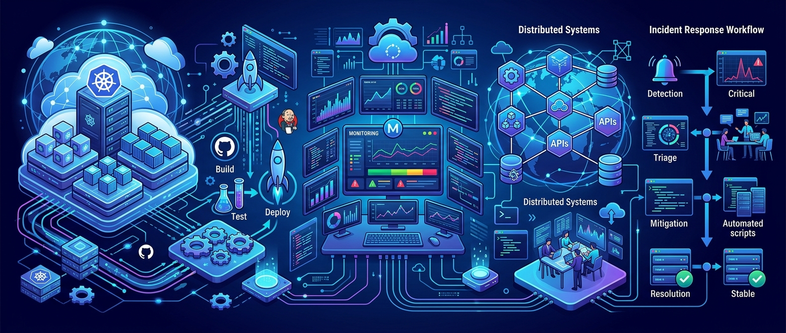
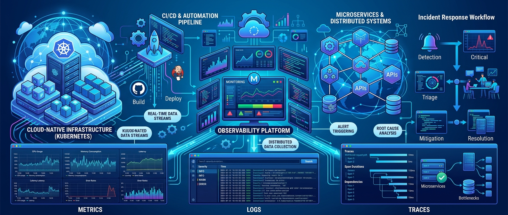
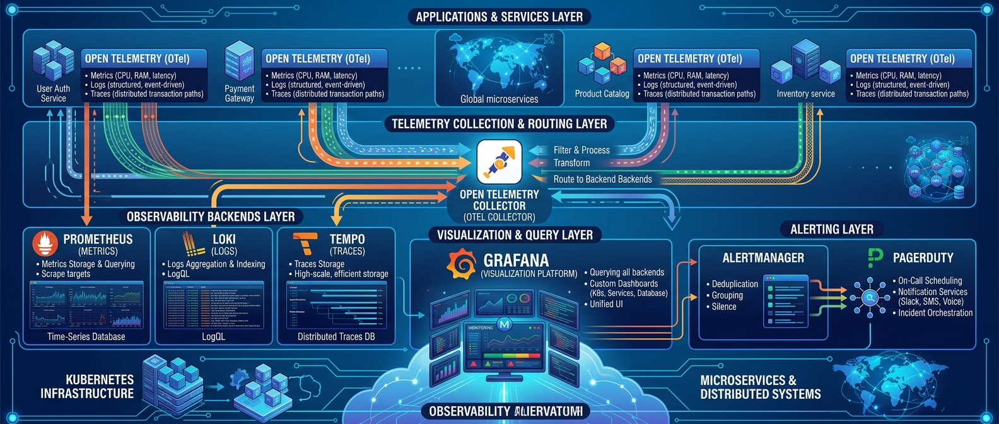
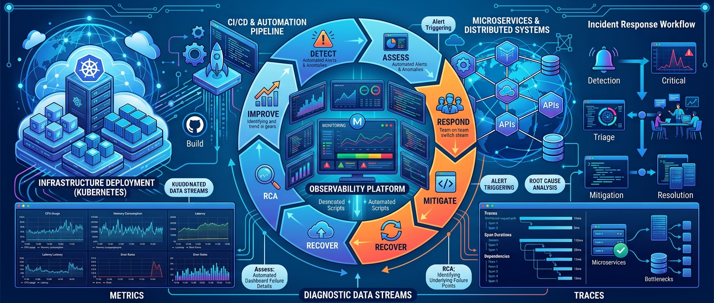

# Site Reliability Engineering

<p align="center">



</p>

<p align="center">
  <strong>Building Reliable, Scalable, Observable, and Resilient Systems</strong>
</p>

<p align="center">
  A practical Site Reliability Engineering handbook that transforms real-world operational experience into reusable knowledge.
</p>

---

# About

This repository is a curated collection of Site Reliability Engineering (SRE) concepts, practical guides, troubleshooting methodologies, operational best practices, and lessons learned from real-world production environments.

The objective is to create a long-term knowledge base that helps engineers design, operate, monitor, troubleshoot, and continuously improve modern distributed systems.

Whether you are a:

- Site Reliability Engineer (SRE)
- DevOps Engineer
- Platform Engineer
- Cloud Engineer
- Systems Engineer
- Software Engineer supporting production workloads

this repository aims to provide practical, actionable, and reusable knowledge.

---

# Topics Covered

## Reliability Engineering

- SLI, SLO, SLA
- Error Budgets
- Reliability Fundamentals
- Capacity Planning
- Scalability Patterns
- High Availability
- Disaster Recovery
- Fault Tolerance

## Observability

- Metrics
- Logs
- Traces
- OpenTelemetry
- Distributed Tracing
- Monitoring Strategies
- Dashboards
- Telemetry Collection

## Alerting & Monitoring

- Alert Design Best Practices
- Alert Fatigue Reduction
- Alert Routing
- Escalation Policies
- On-call Operations
- Incident Detection

## Cloud Operations

- Amazon Web Services (AWS)
- Microsoft Azure
- Google Cloud Platform (GCP)

## Kubernetes & Containers

- Cluster Health
- Node Troubleshooting
- Pod Diagnostics
- Resource Management
- Kubernetes Observability
- Scaling Strategies

## Incident Management

- Incident Response
- Major Incident Handling
- Service Restoration
- Root Cause Analysis (RCA)
- Postmortems
- Continuous Improvement

## Automation

- Bash Automation
- Python Automation
- Infrastructure Automation
- Operational Excellence

## Interview Preparation

- Linux
- Networking
- Kubernetes
- Cloud Platforms
- Observability
- Incident Management
- Production Support
- SRE System Design

---

# Core Pillars of SRE

<p align="center">

  

</p>

The repository focuses on the foundational principles that drive successful Site Reliability Engineering:

- Reliability
- Scalability
- Performance
- Observability
- Automation
- Incident Management
- Continuous Improvement

---

# Observability Architecture

<p align="center">



</p>

A modern observability platform typically combines:

```text
Applications
      │
      ▼
OpenTelemetry
      │
 ┌────┼────┐
 ▼    ▼    ▼

Metrics Logs Traces

 ▼      ▼      ▼

Prometheus Loki Tempo/Jaeger

        │
        ▼

Grafana

        │
        ▼

Alertmanager

        │
        ▼

PagerDuty / Teams / Slack
```

---

# Incident Management Lifecycle

<p align="center">

  

</p>

```text
Detect
  ↓
Assess
  ↓
Respond
  ↓
Mitigate
  ↓
Recover
  ↓
Root Cause Analysis
  ↓
Improve
```

---

# Repository Structure

```text
site-reliability-engineering
│
├── images/
│
├── fundamentals/
│   ├── reliability-engineering
│   ├── sli-slo-sla
│   └── error-budgets
│
├── observability/
│   ├── metrics
│   ├── logging
│   ├── tracing
│   ├── prometheus
│   ├── grafana
│   └── opentelemetry
│
├── cloud/
│   ├── aws
│   ├── azure
│   └── gcp
│
├── kubernetes/
│
├── linux/
│
├── networking/
│
├── incident-management/
│
├── runbooks/
│
├── automation/
│
├── troubleshooting/
│
├── interview-preparation/
│
└── README.md
```

---

# Learning Roadmap

- [ ] SRE Fundamentals
- [ ] Linux for SRE
- [ ] Networking for SRE
- [ ] Monitoring & Alerting
- [ ] Prometheus Deep Dive
- [ ] Grafana Dashboards
- [ ] OpenTelemetry
- [ ] Distributed Tracing
- [ ] Kubernetes Troubleshooting
- [ ] Cloud Monitoring (AWS, Azure, GCP)
- [ ] Incident Management
- [ ] Production Support Playbooks
- [ ] Automation & Reliability Engineering
- [ ] SRE Interview Preparation

---

# Guiding Principles

- Automate repetitive work
- Measure everything important
- Design for failure
- Reduce operational toil
- Continuously improve reliability
- Learn from incidents
- Build observable systems
- Prioritize user experience

---

# Contributing

Contributions, improvements, corrections, and operational learnings are welcome.

If a runbook, playbook, troubleshooting guide, or engineering practice has helped you solve a real-world problem, feel free to contribute.

---

# Disclaimer

This repository contains knowledge, examples, and engineering practices gathered from personal learning, research, and industry experience.

All confidential, proprietary, and organization-specific information has been intentionally excluded.

---

# Support the Repository

If you find this repository useful:

⭐ Star the repository

🔔 Follow for updates

🤝 Share with fellow engineers

Together we can build a practical and valuable Site Reliability Engineering knowledge hub for the community.

---

> "Hope is not a strategy. Reliability is engineered."